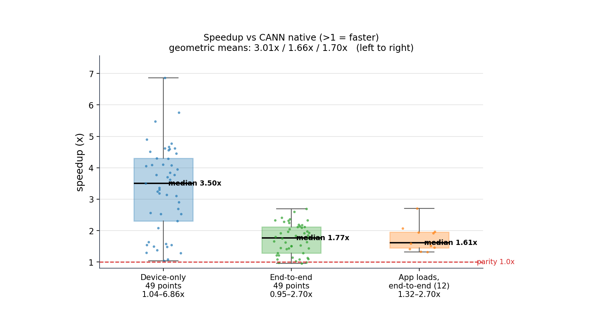

# Ascend-FFT

[](LICENSE)
[](CITATION.cff)
[](config/ascend910_93_profile.json)
[](docs/阶段0-1-发现与结果.md)
[](docs/matrix_test_a7.md)

**Ascend-FFT 是一个跑在华为昇腾 NPU 上的复数 fp32 FFT 库，另带实数半谱 `r2c` / `c2r` 变换。**
device kernel 用 AscendC 写，host 侧带一层「枚举 → 计费 → 实测回填」的选型框架。
在 Ascend910_9382（48 AIV）全网格 49 个 `(n, batch)` 点上，**device-only 对 CANN 原生复数 FFT 49 : 0**。
设计移植自 [**cuButterfly**](https://github.com/TruNcat3/cuButterfly)（BSD-3-Clause）。

**一句话总结。** 相较于 CANN 原生复数 FFT（**>1 = 自研更快**），三种计时口径全部占优：

| 口径 | 计时范围 | 结果 |
|---|---|---|
| **device-only** | 只测 kernel 执行 | **49 / 49**，几何均值 **3.01×**（1.04× ~ 6.86×） |
| **端到端** | `H2D 拷贝 → 一次前向复数 FFT → D2H 拷贝`（pinned 主机缓冲；启动 / plan / 输入生成在计时区外） | **46 / 49**，几何均值 **1.66×**（1.02× ~ 2.70×），输的 3 点 0.95× ~ 0.99× |
| **应用负载** | 同上，输入换成三类应用的真实形状（OFDM / 雷达距离门 / DL 频域层，12 个代表形状） | **12 / 12**，几何均值 **1.70×**（1.32× ~ 2.70×） |



**图 8 —— 加速比的分布**：三个箱依次对应上面三行（箱体 Q1~Q3、粗线中位数、须到 min / max、
散点为逐点值），红虚线是 1.0× 打平线。逐点数值与拆分原因见下文 `结果`。

> **English.** Ascend-FFT is a radix-2 DIT complex fp32 FFT library for Huawei Ascend NPUs,
> written in AscendC, with a host-side framework that enumerates a design space, prices each
> candidate with a cost model, and back-fills real measurements. It also ships real-input
> `r2c` / half-spectrum `c2r` transforms (numpy `rfft` / `irfft` layouts). Its object set
> (`H/G/A/P/L/F/Q`), `Context`/`Plan`/`Transform` API shape, batch-parallel decomposition and
> model-driven search are ported from [cuButterfly](https://github.com/TruNcat3/cuButterfly)
> (BSD-3-Clause). See [THIRD_PARTY_NOTICES.md](THIRD_PARTY_NOTICES.md) for provenance.

---

## 架构

<p align="center">
  
</p>

图由 [`scripts/gen_arch_diagram.py`](scripts/gen_arch_diagram.py) 生成
（`python3 scripts/gen_arch_diagram.py`，输出字节稳定、不写时间戳）。

**怎么读这张图：**

- **上半是选型闭环**，四层各管一件事：① `config/*.json` 存探针实测出来的硬件事实；
  ② 设计空间把事实翻译成「可行 / 不可行 + 不可行的原因」的候选集合；
  ③ `estimate()` 在 kernel **还没编译**时给每个候选算一笔账（η），`rank()` 按估算排序取 `topK`；
  ④ 逐个 `prepare()` → `measure()` 实测并回填 ——
  **量过的候选永远排在只是估过的前面**（`Measured > Feasible > Unverified`）。
- **下半是端到端数据流**：`float32` 交错复数 `[batch][2n]` 进出，旋转因子与三张索引
  由 host 预生成、随 plan 一次上传，设备上只跑变换本身。
- **两个计时区不要混**：`device-only` 只框 kernel 的 launch + 同步；`端到端` 框住
  H2D + 变换 + D2H，三方主机缓冲统一 **pinned**（`AB_E2E_HOST`）。
- 图中每个数字都指得回命令：硬件事实 → [`scripts/hw_probe.sh`](scripts/hw_probe.sh)，
  候选与四态 → `ctx.enumerate()`（[`tests/test_framework.cpp`](tests/test_framework.cpp)），
  η → [`scripts/calib_eta.py`](scripts/calib_eta.py)，
  比分 → [`docs/matrix_test_a7.md`](docs/matrix_test_a7.md)。

---

## 为什么做这个

**Ascend 上缺一个能直接调的复数 FFT。** CANN 9.0.0 的公开头文件里没有复数→复数的
FFT C API（`include/` 全量扫描只有 `aclRfft1D` 与 `aclStft` 两个）。大家平时用的
`torch.fft.fft` 走的是 torch_npu 自己注册的 `_fft_c2c` NPU 算子，
**不在 CANN 的算子库条目里**。于是 host 侧 C++ 想做一次复数 FFT，要么绕进 Python/torch，
要么自己写 kernel。本仓库补上后者 —— 一个 AscendC 的 radix-2 DIT 复数 fp32 FFT
（外加 `r2c` / `c2r` 实数半谱变换），外加一层 `Context` / `Plan` 的 C++ 框架。

**但比「能跑」更重要的是「知道为什么快、也知道什么时候不快」。** 所以这个仓库把三样东西
做成了可测量的：

- **硬件事实**——UB 上限、Level-0 `mask` 上限、`repeat` 上限、32B 对齐、有没有 SIMT，
  全部由探针实测得出，人工回填 `config/*.json`，不靠推断；
- **成本模型 η**——kernel 还没编译就能算出这一趟要多少 µs，选型闭环因此才跑得起来；
- **改动的证据链**——4 道门禁 + 49 点矩阵 + 交替 A/B，加上能从任意历史提交重建基线 `.o`
  的脚本，文档里每个数字都指向一条命令。

**边界也照写。** device-only 全胜，但端到端仍有 3 个大 batch 点跌到 1.0× 以下
（0.95×~0.99×，被 PCIe 搬运封顶；46/49，几何均值 1.66×）；
小 batch 输给 CPU 单核（NPU 要付固定的发射开销）；本 SoC 没有 SIMT，设计空间里
`local_exchange = shuffle` 直接判 `Infeasible`；Cube 探针的结论是「矢量发射墙，不是算力墙」。
这些都躺在各自文档里，不藏。

---

## 结果

全网格 49 点：`n ∈ {64…4096}` × `batch ∈ {1…4096}`，`--reps 20 --rounds 3`、逐点取 min-of-means。
**图编号沿用 [`docs/实验对比.md`](docs/实验对比.md)** —— 图 1~7 的完整版、逐点详表与
**每张图的详细解读只在那一份**；图 8 是本 README 专用的分布图，与它同批生成。


**图 1 —— 自研 ÷ CANN 原生（同卡、同变换、同口径），>1 表示自研更快；
没有任何一格跌破 1.0×，几何均值 3.01×。** 优势集中在哪、为什么大 batch 收窄，见
[实验对比 · 图1](docs/实验对比.md#图1-49-点-speedup-热力图) 与
[图3](docs/实验对比.md#图3-speedup-与延迟随-batch-缩放)。

| 指标 | 结果 |
|---|---|
| 正确性（双精度 CPU 参考，`maxRel ≤ 1e-4`） | **49 / 49 PASS**（worst 2.44e-7） |
| **vs CANN 原生复数 FFT**（同卡同变换） | **49 : 0**，几何均值 **3.01×** |
| 最好 / 最紧倍率 | **6.86×** @ `n=128,B=4` ｜ **1.04×** @ `n=1024,B=4096` |
| 头条点 `n=4096,B=4096` | 1,492.7 vs 2,444.7 µs = **1.64×**（674 GFLOP/s） |
| 端到端（H2D + 变换 + D2H，启动/plan/输入生成在计时区外，pinned 主机缓冲，[口径 §6.2](docs/实验对比.md#62-口径)） | **46 / 49** 更快，几何均值 **1.66×**（`B≤64` **28 / 28**、2.01×） |
| 应用负载端到端（OFDM / 雷达距离门 / DL 频域层，应用形状输入，12 个代表形状，[§6.4](docs/实验对比.md#64-三类典型应用负载)） | **12 / 12** 更快，几何均值 **1.70×**；device-only **3.12×**；正确性 **12 / 12 PASS** |
| η 成本模型偏差 | 平均 **7.7%**，43/49 落在 ±15% 内（带外 6 点见 [实验对比 图5](docs/实验对比.md#图5-成本模型-η-vs-实测)） |
| vs numpy / torch (CPU) | **36 / 49**、**38 / 49**（`B≥1024` 各 **14 / 14**） |
| vs 自研 v1（标量旋转因子版） | **49 / 49**，中位 **11.2×**、最好 **38.8×** |

逐点数值见 [`docs/matrix_test_a7.md`](docs/matrix_test_a7.md)；
六基线（numpy / torch / `aclRfft1D` / v1 / 原生 / 自研）同场见
[`docs/性能对比-标准库vs自研.md`](docs/性能对比-标准库vs自研.md)。

**实数半谱变换（r2c / c2r）。** 同一套 `kfft_fwd` 之上还提供 `r2c`（实数输入 → `n/2+1` 个复数，
`numpy.fft.rfft` 稠密布局）与 `c2r`（半谱 → 实数，含 `1/n`，`numpy.fft.irfft` 口径）——
CANN 9.0.0 的 C API 只有 `aclRfft1D`（实→复），**没有 c2r**。49 点全网格 device-only
（与主矩阵同 reps 政策，逐点 min）：

| 指标 | 结果 |
|---|---|
| 正确性（r2c `n=128…8192`、c2r `n=64…4096` × `B=1…4096`） | **98 / 98 PASS**，`maxRel ≤ 3.1e-7` |
| r2c（42 点，`n≥128`） | 自研 **65.2 µs**，vs torch.fft.rfft **1.84×**、vs `aclRfft1D` **3.21×** |
| c2r（49 点） | 自研 **60.5 µs**，vs torch.fft.irfft **3.06×** |

复现：[`scripts/repro.sh r2c-c2r`](scripts/repro.sh)（逐点见
[`results/r2c_c2r.json`](results/r2c_c2r.json)）；框架入口
[`Plan::runR2C` / `runC2R`](#api-概览)；链路设计与机制见
[`docs/实数变换-r2c与c2r.md`](docs/实数变换-r2c与c2r.md)。

**端到端那一行测的应用形态。** 计时区间就是 `H2D 拷贝 → 一次前向复数 FFT → D2H 拷贝`，
即「数据落在 host、变换放在卡上」这类程序的最小闭环；多载波通信 / 频域均衡、
雷达成像的距离门、深度学习的频域层三类应用在这一步形状完全一样 ——
一批 `[batch][2n]` 的复数搬上去、做一次前向 FFT、结果整批搬回来。
12 个代表形状实测 device-only **12 / 12、3.12×**，端到端 **12 / 12、1.70×** ——
换输入、换代表性 shape 都不改变结论；形状清单、开源参考（srsRAN / GNU Radio / Kymatio）
与逐点见 [实验对比 §6.4](docs/实验对比.md#64-三类典型应用负载)。
**口径**：网格读数用**随机输入**测 —— 这几段的时间只取决于字节数与 kernel 本身，
与数据内容无关；三者各自的前处理（解调、CFAR、反归一化）**不在**计时区内。

> **其余各图都在 [`docs/实验对比.md`](docs/实验对比.md)**（详细解读只在那一份）：
> [图2 延迟热力图](docs/实验对比.md#图2-延迟热力图) ·
> [图3 speedup 与延迟随 batch 缩放](docs/实验对比.md#图3-speedup-与延迟随-batch-缩放) ·
> [图4 六基线同场](docs/实验对比.md#图4-六基线同场对比) ·
> [图5 成本模型 η](docs/实验对比.md#图5-成本模型-η-vs-实测) ·
> [图6 端到端](docs/实验对比.md#图6-端到端测试) ·
> [图7 自研 / torch / 裸 CANN 三路端到端](docs/实验对比.md#图7-三路端到端自研--torch--裸-cann)
> （结论很有意思：`n≤256 且 B≤64` 的 12 个点上，**裸 CANN C API 103 µs、
> torch 原生 92 µs、自研 19 µs** —— 那 ~100 µs 的固定开销在 CANN 调用路径本身，不在 torch 层）。

---

## 快速开始

### 环境要求

| 项 | 要求 |
|---|---|
| SoC | `Ascend910_9382`（48 AIV / 196608 B UB），改 SoC 需同步 `AB_SOC` 与 `config/*.json` |
| CANN | 9.0.0（`ccec` + `libascendcl`），路径由 `AB_CANN` 指定、默认自动探测 |
| 编译器 | host `g++ -std=c++17` |
| Python | 任意带 `torch` + `torch_npu` 的 `python3`，解释器由 `AB_PY` 指定、默认自动探测 |

**所有路径都统一由 [`scripts/env.sh`](scripts/env.sh) 探测并导出**，不硬编码：

| 变量 | 含义 | 默认 |
|---|---|---|
| `AB_CANN` | CANN 工具包根 | `ASCEND_TOOLKIT_HOME` → 最新 `/usr/local/Ascend/cann-*` → `ascend-toolkit/latest` → `PATH` 里的 `ccec` |
| `AB_PY` | 带 torch_npu 的 python | `python3` → 逐个试 import（结果缓存到 `.ab_py`） |
| `AB_MSPROF` | msprof 路径 | `PATH` → `$AB_CANN/bin` → `$AB_CANN/tools/profiler/bin` |
| `AB_WORK` | 临时工作区（profile 等） | `<仓库>/.tmp` |
| `AB_SOC` | SoC 名 | `Ascend910_9382` |
| `AB_ROOT` / `AB_BUILD` | 仓库根 / `build/` | 自动 |

用法：`source scripts/env.sh`（所有脚本已自动 source），或直接
`AB_CANN=/opt/cann/8.0.0 AB_PY=/usr/bin/python3.10 scripts/build.sh all` 覆盖。
Python 侧同一套规则在 [`scripts/abenv.py`](scripts/abenv.py)。

**实验口径开关**（不参与路径探测；默认值就是本文全部数字所用的口径）：

| 变量 | 含义 | 默认 |
|---|---|---|
| `AB_E2E` | 打开端到端计时区（H2D + 变换 + D2H），值为重复次数 | 关 |
| `AB_E2E_HOST` | 端到端的主机缓冲：`pinned`（三方同口径）\| `pageable`（受限对照） | `pinned` |
| `AB_E2E_MODE` | `async`（带流 memcpy + 显式同步）\| `sync`（阻塞 memcpy）\| `xfer`（只搬不算，隔离纯传输带宽） | `async` |

端到端一律用 **pinned** 主机缓冲：pageable 会把「拷贝路径没选对」记进结果，
`device-only` 一列不受影响，详见 [实验对比 §6.3](docs/实验对比.md#63-已知局限必须一起读)。

### 三条命令

```bash
scripts/init.sh             # 从零：环境体检 → 编译 → 4 道门禁（最快，不跑矩阵）
scripts/init.sh --check     # 只体检，不编译不跑门禁
scripts/init.sh --quick     # 上面 + 9 点抽样矩阵（约 5 min）
scripts/init.sh --matrix    # 上面 + 49 点全网格（最慢）
scripts/one_click_test.sh   # 编译 → 4 道门禁 → 49 点矩阵 → 结论，结果落 results/<UTC>/
scripts/one_click_test.sh --no-matrix   # 只编译 + 4 道门禁（最快）
```

门禁顺序：`test_limits`(18 项边界) → `test_framework`(4 抽样点) →
`stride_probe`(23 PASS / 7 预期 FAIL) → `fft_check`(4 抽样点) →
矩阵判据（正确性 / 比值全 ≥1× / η 偏差）。失败则 `exit 1`。

### 手动构建与单点运行

```bash
./scripts/build.sh all stride      # kernel + host + 测试；target 见 scripts/build.sh 头部
make                                # 等价（根目录 Makefile），make help 列全部目标

./build/fft_check <n> <batch> [reps=10]                    # 正确性 + 实测
AB_FOLD_D=4 AB_PLANE_K=16 ./build/fft_check 1024 4096 30   # 强制批折叠系数 D / 平面级 K
AB_FFT_O=build/fft_radix2_v1.o ./build/fft_check 64 1 20   # 指定 kernel .o
```

---

## API 概览

C++ API（**不提供稳定 C ABI**），完整声明在 [`include/butterfly/`](include/butterfly/)：

```cpp
#include "butterfly/plan.hpp"

bfly::Context ctx;
ctx.init("config/ascend910_93_profile.json",   // H：硬件事实
         "config/butterfly_space.json",        // 设计空间轴（唯一真源）
         "build/fft_radix2.o");                // device kernel

// 选型循环：η 预排序 → 前 topK 个候选各构一个 plan → 实测 → 取最优
std::unique_ptr<bfly::Plan> plan = ctx.select(4096, 4096, /*topK=*/3);
// 想自己看盘：ctx.enumerate(4096, 4096) 返回全部候选（含 Infeasible 及原因）

plan->prepare(4096, 4096);             // 生成并上传旋转因子/索引（幂等）
plan->run(in, out, 4096, 4096);        // 一次 n×batch 复数 fp32 前向 FFT
bfly::Metric m;
plan->measure(4096, 4096, &m);         // 实测 µs，回填 Metric 并置 Measured

// 实数半谱变换（需 build/fft_real.o，与 kernelPath 同目录；缺文件时返回 -1）
plan->runR2C(xReal, spec, 4096, 4096); // [batch][n] 实数 -> [batch][n+2] 半谱（n/2+1 复数）
plan->runC2R(spec, yReal, 4096, 4096); // [batch][n+2] 半谱 -> [batch][n] 实数（含 1/n）
```

输入/输出布局：`float32` **交错复数** `[batch][2*n]`（`re, im, re, im, ...`）。
`r2c` / `c2r` 为**稠密半谱** `[batch][n+2]`（`numpy.fft.rfft` / `irfft` 布局；
c2r 输入的 Nyquist 虚部须为 0）。

核心启发式（`include/butterfly/fft_k.hpp`）：

```cpp
uint32_t planeKFor(uint32_t n);                  // 平面级 K：只看 n，纯静态
uint32_t foldDFor(uint32_t n, uint32_t batch,
                  uint32_t nblk = 1);            // 批折叠 D：kFoldCap=4，nblk = 并发核数
```

---

## 文档导航

按目的挑一条线，不用从头读到尾（每份文档头部都带「复现脚本」一行）：

| 你想… | 去哪 |
|---|---|
| 知道它是什么 | [架构](#架构)：四层选型闭环与端到端数据流一张图 |
| 看结果（图 + 详表 + 每图解读） | [`docs/实验对比.md`](docs/实验对比.md)：图1~7、49 点详表、端到端与三类应用负载 |
| 看逐点矩阵 | [`docs/matrix_test_a7.md`](docs/matrix_test_a7.md)：当前权威 49 : 0 |
| 搞懂为什么快、数字怎么涨上来的 | [`docs/设计思路与演进.md`](docs/设计思路与演进.md)：4 条思路 + 阶段 0 → 49 : 0 时间线 |
| 改 kernel / 模型（5 轮 A/B 全记录） | [`docs/性能优化-C2b与K择优.md`](docs/性能优化-C2b与K择优.md) |
| 从零到跑通、换 SoC 的硬件探针 | [`docs/阶段0-1-发现与结果.md`](docs/阶段0-1-发现与结果.md) |
| 看 msprof 诊断 | [`docs/trace与profile诊断-小尺寸与大尺寸.md`](docs/trace与profile诊断-小尺寸与大尺寸.md) |
| r2c / c2r 半谱链路 | [`docs/实数变换-r2c与c2r.md`](docs/实数变换-r2c与c2r.md) |
| 对照公开 GPU 结果 / Cube 探针 | [`docs/矩阵测试与GPU绝对性能对比.md`](docs/矩阵测试与GPU绝对性能对比.md) · [`docs/Cube张量化探针.md`](docs/Cube张量化探针.md) |
| 从零跑起来 | [快速开始](#快速开始)：一条 `scripts/init.sh` |
| 全仓清单：实验 ↔ 脚本 ↔ 文档、脚本职责、术语速查 | [`docs/README.md`](docs/README.md) |

**复现入口**：`scripts/init.sh` 从零到能跑；`scripts/repro.sh --list` 列全部实验，
`scripts/repro.sh --doc <文档名片段>` 按文档反查。
存档：[`docs/matrix_test_raw.md`](docs/matrix_test_raw.md)（批折叠前的 44:5，**表不改**）。

---

## 设计来源

本项目的**设计来源是 [cuButterfly](https://github.com/TruNcat3/cuButterfly)** ——
一份 GPU 上的硬件映射时空并行 FFT / NTT / FWHT 库。移植关系如下：

| cuButterfly | 本仓库 | 说明 |
|---|---|---|
| `plan.hpp` 对象集 | `include/butterfly/objects.hpp` | `H`(硬件) `G`(生成) `A`(映射) `P`(分段) `L`(布局) `F`(融合) `Q`(质量) |
| `Context` / `Plan` / `Transform` | `include/butterfly/plan.hpp` | C++ API（**不提供稳定 C ABI**） |
| `Ub·Tb` 批并行循环 | `foldDFor(n, batch)` 批折叠 | 一次 Level-0 repeat 覆盖 D 个连续 batch |
| 旋转因子表 + `kBitReverseInput` | `Generator::genTwiddles` / `genBitReverse` / `genInterleave` | host 生成、随 plan 上传 |
| 设计空间 + 搜索 + 计分 | `DesignSpace` + `enumerate` + `estimate` + `rank` | `config/*.json` 为唯一真源 |
| `local_exchange = shuffle` | ⛔ 不可用 | 本 SoC 无 SIMT（`--enable-simt` 被 ccec 拒绝），只有 `shared`/`register` 可行 |

上游 README 里「What Is Frozen In v0.8」那张表也值得记住：cuButterfly 在 V100 上
对 cuFFT 是**部分 shape 打平、饱和大 batch 反而更慢**。这说明我们和它共享的是
**方法论**（硬件事实 → 设计空间 → 成本模型 → 实测回填），而不是可以白拿的数字。

**未复制任何上游源文件**：本仓库每个翻译单元都是面向 Ascend 的 AscendC / host C++ 重写。
上游仅作为设计出处引用，完整声明见 [THIRD_PARTY_NOTICES.md](THIRD_PARTY_NOTICES.md)。

---

## 目录结构

```
ascend-fft/
├── include/butterfly/        公共头文件（API + 静态启发式）
│   ├── plan.hpp                Context / Plan / Transform
│   ├── objects.hpp             H G A P L F Q 设计空间对象
│   ├── enumerate.hpp           四态枚举 + 候选排序（Measured > Feasible > Unverified）
│   ├── fft_k.hpp               planeKFor / foldDFor
│   └── reference.hpp           双精度 FFT 参考 + maxRel 判据
├── src/
│   ├── ascendc/               device kernel（AscendC）
│   │   ├── fft_radix2.cpp       主 kernel（批折叠 + 平面级 radix-4 融合）
│   │   ├── fft_radix2_v1.cpp    v1 基线（标量旋转因子）
│   │   ├── fft_radix2_v2.cpp    v2（前 3 级 8-plane 布局）
│   │   ├── fft_real.cpp         r2c/c2r 链三内核（r2c_post / c2r_prep / c2r_post）
│   │   ├── probe_hw.cpp / probe_simt.cpp
│   │   └── {stride,gather,cube}_probe.cpp
│   ├── framework/             host 框架（`estimate()` 计费、选型、索引生成、launch）
│   │   ├── butterfly.cpp        Context/Plan 实现 + `estimate()`/`rank()`/`Plan::measure()` 主体
│   │   └── reference.cpp        参考实现 + 测试向量
│   └── host/                  可执行入口（fft_check / stride_probe / 探针 / launch）
│       ├── baseline_rfft.cpp    裸 CANN `aclRfft1D` 三路对照基线
│       └── profile.cpp          msprof 用例入口
├── tests/                    test_limits(18) / test_framework
├── config/                   硬件 profile + 设计空间 JSON（唯一真源）
├── scripts/                  构建 / 初始化 / 实验运行器（职责一览见 docs/README.md · 复现）
├── docs/                     设计与实验文档（索引见 docs/README.md）
├── results/                  一键测试与 profile 输出（默认 git 忽略；`e2e.{json,md}` 与 `r2c_c2r.json` 作为存档跟踪）
├── CITATION.cff              GitHub「Cite this repository」引用元数据
├── LICENSE                   Apache-2.0
└── THIRD_PARTY_NOTICES.md    cuButterfly 出处与 BSD-3-Clause 文本
```

---

## Citation

使用本软件或其实验数据请引用 [`CITATION.cff`](CITATION.cff)。BibTeX：

```bibtex
@software{wang_ascendfft_2026,
  author  = {Teng Wang},
  title   = {Ascend-FFT: Hardware-Mapped Complex FFT on Huawei Ascend NPUs},
  year    = {2026},
  version = {0.1.0},
  url     = {https://github.com/TruNcat3/ascend-fft}
}
```

本仓库的**设计来源**是 [cuButterfly](https://github.com/TruNcat3/cuButterfly)，
一并引用（其许可见 [`THIRD_PARTY_NOTICES.md`](THIRD_PARTY_NOTICES.md)）：

```bibtex
@software{wang_cubutterfly_2026,
  author  = {Teng Wang},
  title   = {cuButterfly: Hardware-Mapped Space-Time Parallelism for Butterfly Computations on GPUs},
  year    = {2026},
  version = {0.9.0},
  url     = {https://github.com/TruNcat3/cuButterfly}
}
```

Author: **Teng Wang**, High Efficient Intelligent Computing Lab, Suzhou
Institute for Advanced Research of USTC, Suzhou, China.

## License

本仓库以 [**Apache License 2.0**](LICENSE) 发布。

设计来源 **cuButterfly** 采用 **BSD 3-Clause**，版权与完整条款见
[**THIRD_PARTY_NOTICES.md**](THIRD_PARTY_NOTICES.md)。
