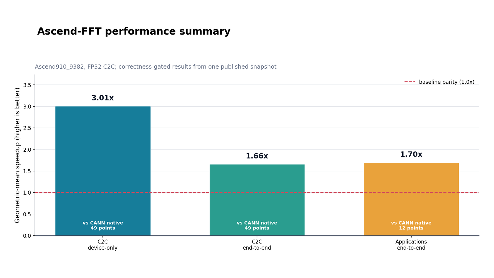
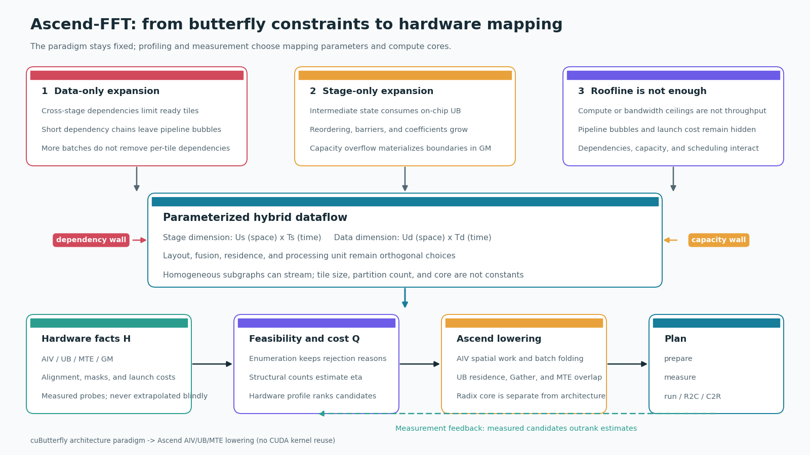

# Ascend-FFT

[](https://truncat3.github.io/ascend-fft/)
[](LICENSE)
[](CITATION.cff)
[](docs/reference/support.md)
[](https://github.com/TruNcat3/cuButterfly)

**Ascend-FFT 是面向华为昇腾 NPU 的高性能 FFT 算子库与跨平台方法实践。** 项目目标是在统一
Plan 接口下逐步覆盖不同精度、长度、批量、变换语义和硬件，并用硬件 profile、参数化设计空间、
成本模型和实测回填为每个工作负载选择执行计划，而不是固化一组尺寸或一种计算核心。

<p align="center">
  <a href="https://www.ustc.edu.cn/">
    
  </a>
</p>
<p align="center">
  <strong>Teng Wang</strong><br>
  High Efficient Intelligent Computing Lab<br>
  <a href="https://sz.ustc.edu.cn/en/index.html">Suzhou Institute for Advanced Research,
  University of Science and Technology of China</a> · Suzhou, China<br>
  <a href="mailto:wangt635@ustc.edu.cn">wangt635@ustc.edu.cn</a>
</p>

> Ascend-FFT 是作者独立维护的研究软件。机构名称和标识仅用于说明作者归属，不表示中国科学技术大学
> 或相关机构对本项目作官方发布、认证或背书。详情见[项目与作者](docs/about.md)。

## 与 cuButterfly 的关系

本项目是 [cuButterfly](https://github.com/TruNcat3/cuButterfly) 方法在 Ascend 上的迁移实例：
保留“阶段维度与数据维度同时进行空间/时间划分”的架构范式，但不复用 CUDA kernel；计算、布局、
存储和同步均重新映射到 AIV、UB、MTE 与 GM。方法来源与差异见[相关工作](docs/benchmarks/related-work.md)。

## 当前能力

下表是当前发布版本已经验证的实现范围，不是项目的最终能力边界。

| 变换 | 精度 | 长度 | 布局 | 状态 |
|---|---|---|---|---|
| C2C forward | fp32 complex | 2 的幂，`64..4096` | host 交错复数 `[batch][2n]` | 稳定实验路径 |
| R2C | fp32 real | 偶数，`128..8192` | `[batch][n] -> [batch][n+2]` | 已验证 |
| C2R | fp32 half spectrum | 偶数，`64..4096` | `[batch][n+2] -> [batch][n]` | 已验证 |

当前 C++ API 使用 host 指针并同步完成 H2D、变换和 D2H；尚不提供稳定 C ABI、device-pointer
异步 API、逆向复数 C2C 或跨设备执行。完整边界见[支持矩阵](docs/reference/support.md)。

## 性能概览

<!-- BEGIN GENERATED: benchmark-summary -->



| 工作负载 | 严格基线 | 点数 | 几何均值 speedup |
|---|---|---:|---:|
| C2C device-only | CANN 原生复数 FFT（torch_npu） | 49 | **3.01x** |
| C2C end-to-end | 同上，pinned H2D + FFT + D2H | 49 | **1.66x** |
| 应用 shape end-to-end | 同上，OFDM / 雷达 / DL 频域层 | 12 | **1.70x** |

<!-- END GENERATED: benchmark-summary -->

数据来自 Ascend910_9382、CANN 9.0.0、fp32 发布快照。C2C device-only 为 49/49 点胜出；
end-to-end 为 46/49 点胜出。每根柱子都标注自己的同语义基线，跨 GPU 数据不参与几何均值。
R2C/C2R 已有实现，但历史性能数据尚未按当前逐行门禁协议重采，因此不进入本次快照总览。
查看[实验结果](docs/benchmarks/results.md)、[测量协议](docs/benchmarks/methodology.md)和
[完整矩阵](docs/generated/matrix.md)。

## 为什么这样设计

单看 Roofline 不能解释蝶形算子在 Ascend 上的流水线空洞。纯数据并行受到跨阶段依赖限制；
纯阶段展开又会迅速增加片上缓存、重排和同步压力。因此 Ascend-FFT 不固定 tile 或分段数，而是
参数化阶段维度和数据维度各自的空间/时间映射，再根据硬件事实排除不可行点。

<p align="center">
  
</p>

执行流程分为四层：

1. 探针记录 AIV、UB、对齐、SIMT、MTE 和调用开销等硬件事实；
2. 设计空间枚举阶段/数据的空间与时间映射，并保留不可行原因；
3. 成本模型按结构计数预排序，而不是按实现名称拟合；
4. 候选 `prepare -> measure -> rank`，实测结果回填并生成最终 Plan。

完整推导见[设计动机](docs/design/motivation.md)与[架构映射](docs/design/architecture.md)。

## 快速开始

### 依赖

- Ascend910_9382；其他 SoC 必须重新运行硬件探针并建立 profile。
- CANN 9.0.0，包含 `ccec` 与 `libascendcl`。
- 支持 C++17 的 host 编译器。
- 基线和绘图需要带 `torch`、`torch_npu` 的 Python。

### 三条命令

```bash
scripts/init.sh --check          # 环境和硬件体检
scripts/init.sh                 # 编译并运行五道正确性门禁
scripts/init.sh --quick         # 再运行 9 点快速性能矩阵
python3 scripts/run_test_profile.py smoke  # 配置驱动的扩展正确性矩阵
```

完整 49 点实验使用 `scripts/repro.sh matrix`。安装与路径覆盖见
[安装指南](docs/getting-started/installation.md)，首次运行见
[Quick Start](docs/getting-started/quickstart.md)。

## 最小 API

```cpp
#include "butterfly/plan.hpp"

bfly::Context context;
context.init("config/ascend910_93_profile.json",
             "config/butterfly_space.json",
             "build/fft_radix2.o");

auto plan = context.select(/*n=*/4096, /*batch=*/64, /*topK=*/3);
plan->prepare(4096, 64);
plan->run(host_input, host_output, 4096, 64);
```

`run()` 的输入输出是 host 指针，并在返回前完成同步。R2C/C2R 的布局、Nyquist 约束、
归一化和错误行为见[变换语义](docs/user-guide/transforms.md)与 [API 参考](docs/reference/api.md)。

## 文档入口

| 目标 | 阅读顺序 |
|---|---|
| 使用库 | [安装](docs/getting-started/installation.md) -> [Quick Start](docs/getting-started/quickstart.md) -> [变换语义](docs/user-guide/transforms.md) -> [API](docs/reference/api.md) |
| 理解方法 | [设计动机](docs/design/motivation.md) -> [架构](docs/design/architecture.md) -> [kernel](docs/design/kernels.md) -> [性能模型](docs/design/performance-model.md) |
| 检查实验 | [基准方法](docs/benchmarks/methodology.md) -> [当前结果](docs/benchmarks/results.md) -> [复现](docs/benchmarks/reproducibility.md) |
| 贡献设计点 | [仓库结构](docs/development/repository-layout.md) -> [增加设计点](docs/development/adding-design-points.md) -> [验证发布](docs/development/validation-and-release.md) |
| 了解项目 | [项目与作者](docs/about.md) -> [未来计划](docs/roadmap.md) -> [引用信息](CITATION.cff) |

完整导航见 [GitHub Pages](https://truncat3.github.io/ascend-fft/) 或 [`docs/index.md`](docs/index.md)。
后续工程实现、能力扩展和测试验收见[未来计划](docs/roadmap.md)。
分层测试、硬件拐点与待扩展负载见[测试策略](docs/testing.md)。

## 复现实验

```bash
scripts/repro.sh --list
scripts/repro.sh matrix
scripts/repro.sh e2e
scripts/repro.sh r2c-c2r
```

实验默认写入 `results/runs/<UTC>-<experiment>/`，不会覆盖手写文档。确认 manifest、正确性和
协议后，使用 `scripts/publish_results.py` 显式更新发布快照。详见
[复现实验](docs/benchmarks/reproducibility.md)。

## Citation

```bibtex
@software{wang2026ascendfft,
  author       = {Teng Wang},
  title        = {Ascend-FFT: A Hardware-Mapped FFT Operator Library for Huawei Ascend NPUs},
  year         = {2026},
  url          = {https://github.com/TruNcat3/ascend-fft},
  organization = {High Efficient Intelligent Computing Lab,
                  Suzhou Institute for Advanced Research,
                  University of Science and Technology of China}
}
```

软件元数据见 [`CITATION.cff`](CITATION.cff)。设计范式来源和 cuButterfly 引用见
[`THIRD_PARTY_NOTICES.md`](THIRD_PARTY_NOTICES.md)。

若使用本仓库的混合数据流设计方法，请同时引用其上游方法仓库：

```bibtex
@software{wang2026cubutterfly,
  author = {Teng Wang},
  title  = {cuButterfly: Hardware-Mapped Space-Time Parallelism for
            Butterfly Computations on GPUs},
  year   = {2026},
  url    = {https://github.com/TruNcat3/cuButterfly}
}
```

## License

Ascend-FFT 使用 [Apache License 2.0](LICENSE)。CANN 与 Ascend 工具链不随本仓库分发，
适用其各自许可证。
