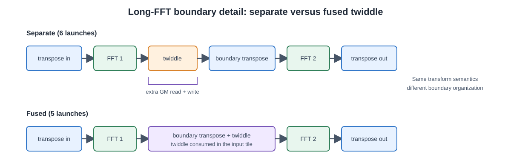

# P0 报告：长 FFT device 链六段归因与同尺寸 torch_npu 基线

> PR #2 性能评论「阶段 2 · P0」的执行报告（第 1 轮）。本页由 `python3 scripts/gen_p0_report.py` 从仓库归档直读生成，复算入口见文末「复现」；不引用任何未归档读数。

## 1. 范围与方法

| 项 | 口径 |
|---|---|
| 六段事件计时 | `fft_check.cpp` 在 device 边界内核发射间插入事件对，`segments:` 行与产生 `device_chain` 最小值的同一次 launch 绑定，`sum(segments) == device_chain`（telescope 恒等）；host/短路径 `segments: NA`。段数随 impl 分支：separate 六段（twiddle 与段边界转置两次发射）、fused 五段（twiddle 并入段边界转置），device 链另打 `boundary_impl:` 自报。`tests/test_scopes.py` + `tests/test_collect_evidence.py` 锁定 |
| 自研协议 | 每形状 5 独立 trial × 5 reps；host `boundary=2`、device `boundary=0`；同一 binary `sha256=bd0e9de55521` |
| 基线协议 | `torch.fft.fft`（torch_npu 2.10.0 op-plugin，复→复）同网格，device-only 与 E2E 各 20 reps 取 min；E2E 为 pinned 口径 |
| 逐 kernel 校验 | msprof `--task-time`（`profile_test.sh --only lfft8k1,lfft16k47,lfft32k47,lfft65k47`），提取值归档于 `results/evidence/long-fft-p0/msprof-task-time.json`，原始 profile 在 `results/profiles/20261009T041621Z/`（本地，不入库） |

归档绑定（全部清洁提交）：device `git=50a5328d`、host `git=51188340`、baseline `git=6a1b3d5c`、fused `git=01ec917f`。

## 2. 六段归因（separate impl，全网格，5-trial 中位数，µs）

| N | B | transpose-in | FFT1 | twiddle | transpose-boundary | FFT2 | transpose-out | device_chain | chain CV% | E2E | E2E CV% | h2d | d2h |
|---|---|---|---|---|---|---|---|---|---|---|---|---|---|
| 8192 | 1 | 45.0 | 10.6 | 6.2 | 44.6 | 7.6 | 43.7 | 158.0 | 4.20 | 348.1 | 7.47 | 53.4 | 56.7 |
| 8192 | 3 | 46.5 | 9.3 | 11.7 | 44.3 | 8.3 | 44.7 | 164.7 | 2.38 | 360.6 | 5.47 | 67.1 | 69.1 |
| 8192 | 47 | 52.7 | 74.2 | 109.0 | 48.4 | 49.2 | 50.6 | 384.2 | 0.14 | 2304.2 | 8.08 | 871.0 | 846.1 |
| 16384 | 1 | 45.7 | 8.0 | 8.5 | 44.3 | 9.6 | 43.9 | 160.9 | 2.51 | 360.8 | 4.78 | 58.7 | 63.1 |
| 16384 | 3 | 46.7 | 9.4 | 12.4 | 45.9 | 11.6 | 44.8 | 171.1 | 3.74 | 615.4 | 17.93 | 107.5 | 130.5 |
| 16384 | 47 | 54.3 | 89.9 | 118.1 | 52.5 | 91.8 | 51.4 | 457.6 | 0.22 | 3087.7 | 26.51 | 1208.5 | 1002.0 |
| 32768 | 1 | 46.9 | 9.3 | 10.4 | 45.6 | 10.9 | 45.1 | 170.8 | 2.51 | 517.4 | 4.25 | 90.2 | 106.6 |
| 32768 | 3 | 47.7 | 14.7 | 19.7 | 45.4 | 13.3 | 45.1 | 186.6 | 3.12 | 686.6 | 16.63 | 119.1 | 152.4 |
| 32768 | 47 | 88.6 | 183.3 | 285.8 | 102.1 | 133.8 | 104.8 | 897.2 | 0.29 | 7972.7 | 3.17 | 3033.0 | 3047.3 |
| 65536 | 1 | 57.4 | 11.4 | 11.6 | 49.2 | 14.1 | 45.1 | 194.2 | 5.46 | 639.0 | 10.84 | 126.2 | 148.2 |
| 65536 | 3 | 54.7 | 19.1 | 23.3 | 46.9 | 21.1 | 45.3 | 209.9 | 3.05 | 730.8 | 17.04 | 175.7 | 259.6 |
| 65536 | 47 | 279.7 | 268.4 | 382.9 | 320.8 | 269.3 | 311.3 | 1832.9 | 0.55 | 13674.9 | 2.10 | 5102.9 | 4231.7 |

数据源：`results/evidence/long-fft-device-boundary/acceptance.json` 的 `points[].trials.raw[].segments/scopes`（`AB_LONG_BOUNDARY_IMPL=separate`，六发射六段；fused 五段对照见 §9）。

## 3. 优先形状的段占比与解读

| 形状 | transpose-in | FFT1 | twiddle | transpose-boundary | FFT2 | transpose-out |
|---|---|---|---|---|---|---|
| 8192x1 | 28.5% | 6.7% | 3.9% | 28.2% | 4.8% | 27.7% |
| 16384x47 | 11.9% | 19.6% | 25.8% | 11.5% | 20.1% | 11.2% |
| 32768x47 | 9.9% | 20.4% | 31.9% | 11.4% | 14.9% | 11.7% |
| 65536x47 | 15.3% | 14.6% | 20.9% | 17.5% | 14.7% | 17.0% |

- **`8192×1`（1.15× 回退点）**：三次转置合计占 chain 的 84.4%，FFT 仅 11.5%、twiddle 3.9% —— 六次发射 + 三次全张量转置的固定成本无法由 batch=1 摊销，与评论「固定成本摊不销」的判断一致；优先级应放在减少转置成本而非 FFT 核心。
- **batch=47 形状：独立 twiddle 是最大单段**（16384×47 25.8%、32768×47 31.9%、65536×47 20.9%），超过任一段 FFT —— 它对中间态做一次完整 GM 读 + 写外加两次 Gather 重排，是 P1 融合（twiddle+transpose-boundary）的首选目标。
- `65536×47` 六段均衡（各 14.6%–20.9%），与带宽受限假设一致（待 MTE/GM/Vector 计数器验证，task-time/event 只能定位昂贵段、不能证明瓶颈类型）；融合后可省去中间态一整次 GM 写+读。

## 4. msprof task-time 交叉验证（µs/launch，4 优先形状）

| 形状 | kfft_lt_tr（3 次合计） | 事件三转置合计 | kfft_fwd（2 次合计） | 事件两 FFT 合计 | kfft_lt_tw | 事件 twiddle |
|---|---|---|---|---|---|---|
| 8192x1 | 128.7 | 133.3 | 16.0 | 18.2 | 5.8 | 6.2 |
| 16384x47 | 155.4 | 158.2 | 178.5 | 181.7 | 116.4 | 118.1 |
| 32768x47 | 280.2 | 295.5 | 310.2 | 317.1 | 259.8 | 285.8 |
| 65536x47 | 719.7 | 911.8 | 527.9 | 537.7 | 336.3 | 382.9 |

msprof 列数据源：`results/evidence/long-fft-p0/msprof-task-time.json`（`sum_prof.py` 从本地 profile 提取的均值口径）；事件列为 device 归档六段中位数之和。

两套独立测量（host 侧事件 vs msprof device task-time）在 b=47 形状逐 op 吻合 21.1% 以内；`8192×1` 的三转置项差 3.5%（profiler 汇入了 E2E 发射，事件只取 chain 最小值的单次 launch，小形状 launch 间散布大）。六段口径可以放心用于后续候选排名；profiler 继续用于解释原因（PipeUtilization 等），不替代真实 event 计时。

## 5. E2E 分解与传输口径

| 形状 | host E2E | device E2E | host/device | device h2d+d2h | 占 device E2E |
|---|---|---|---|---|---|
| 8192x1 | 399.2 | 348.1 | 1.15× | 110.1 | 32% |
| 8192x3 | 428.4 | 360.6 | 1.19× | 136.2 | 38% |
| 8192x47 | 6231.2 | 2304.2 | 2.70× | 1717.1 | 75% |
| 16384x1 | 506.4 | 360.8 | 1.40× | 121.8 | 34% |
| 16384x3 | 859.3 | 615.4 | 1.40× | 238.0 | 39% |
| 16384x47 | 12943.6 | 3087.7 | 4.19× | 2210.5 | 72% |
| 32768x1 | 644.3 | 517.4 | 1.25× | 196.8 | 38% |
| 32768x3 | 1480.1 | 686.6 | 2.16× | 271.5 | 40% |
| 32768x47 | 24181.1 | 7972.7 | 3.03× | 6080.3 | 76% |
| 65536x1 | 1195.0 | 639.0 | 1.87× | 274.4 | 43% |
| 65536x3 | 1952.0 | 730.8 | 2.67× | 435.3 | 60% |
| 65536x47 | 45223.4 | 13674.9 | 3.31× | 9334.6 | 68% |

数据源：`results/evidence/long-fft-acceptance/acceptance.json`（host 链 E2E 中位数）与 `results/evidence/long-fft-device-boundary/acceptance.json`（device 链 E2E/h2d/d2h 中位数）。

- 设备段边界链在 12/12 个形状上降低 E2E（最高 4.19×），无持平/回退形状。
- **自研长链 E2E 的 32%–76% 是 H2D+D2H**（b=47 达 68%–76%），且当前长路径从 `std::vector` 发起（`fft_check.cpp` 的 pinned 分配仅覆盖短路径），为 pageable 口径；下一节基线的 E2E 差距必须先扣除此项再谈 kernel。
- host 链的 E2E 主体是宿主标量段（四步转置/twiddle/重排的 CPU 循环），不是 kernel 慢，比较口径不同。

## 6. 波动性

- device `device_chain` CV：**0.14%–5.46%**（b=47 形状 0.14%–0.55%，b≤3 形状 2.38%–5.46%，短链单次 launch 的时钟分辨率噪声占比更高）。
- device E2E CV：**2.10%–26.51%**（`16384×47` 26.51%、`16384×3` 17.93%、`65536×3` 17.04%），显著高于同形状 chain CV —— 波动来自传输、host dispatch 与环境，不是 FFT 算术核心；评论的判断成立。
- 下一步按评论要求做交错运行 + 环境记录（温度/频率/共租户）后再定是否可接受。

## 7. 同尺寸 torch_npu 基线

完整 12 行对照见生成页 [长 FFT 同尺寸基线](../generated/long-fft-baseline.md)（`results/evidence/long-fft-baseline/baseline.json`，12/12 native PASS，torch 2.10.0 / torch_npu 2.10.0 / CANN 9.0.0，native 20 reps min）。要点：

- **device-only：`native_min / ours_median` = 0.368×–1.104×**（>1 表示自研更快：`65536×3` 为 1.10×、`16384×3` 为 1.06×，其余 native 领先）。native 是单次融合变换不物化本实现的三转置段边界，形态不同；3.4× 的 device-vs-host 结论**不能**外推为对外部库优势。
- **E2E：同一比值 0.116×–0.612×**，b=47 最差（0.116×–0.193×）——其中含自研 pageable 传输口径 vs native 的差距（第 5 节），与 kernel 差距必须分列。
- 两口径、两协议均已归档，后续任何候选以同表复测对比。

## 8. 结论 → P1 优先级

1. **融合 twiddle + transpose-boundary**（`fft_long.cpp`，`kfft_lt_tr` 签名已带 `tw`）：目标消掉最大单段（21%–32%）+ 中间态一整次 GM 写读；验收 = 六段计时 + GM 字节 + A/B/A，六内核路径保留 incumbent（PR-B 已落地 separate/fused 双路径，对照见 §9）。
2. **转置成本**（`8192×1` 占 84.4%、b=47 合计 33%–50%）：tile/LT_H×LT_W 参数化、双缓冲（当前 3×32KB UB，`long_fft_ub.h` 模型已就位）、窄作用域 pipe barrier。
3. **长链 pinned 传输**：修正 E2E 口径，使与 native 的 E2E 对比同口径。
4. **与 native 的形态差距**：P1 融合做完后重新对照；不达标候选不进默认配置。
5. **波动治理**：交错运行 + 环境记录（评论退出条件）。

评论「下一轮退出条件」现状：① 8192×1 不再慢于 host（满足）；② 六段时间可解释 chain（**满足**，§2/§4）；③ 高 CV 未治理（待环境记录）；④ twiddle 融合已做（PR-B separate/fused 双路径，§9）；⑤ torch_npu 同语义矩阵（**满足**，12/12 §7）。

## 9. PR-B R1：twiddle 并入边界转置（separate vs fused 对照）

`AB_LONG_BOUNDARY_IMPL` 双路径：separate = 六次发射六段（twiddle 独立成段），fused = 五次发射五段（`kfft_lt_tr` 在段边界转置的读入 tile 内复乘 twiddle，`tw` 参数直接消费）。归档 `results/evidence/long-fft-device-boundary-fused/acceptance.json`：`boundary=device-fused`、`impl=fused`，每 trial 自报 `boundary_impl: fused` 且段数契约由 collect 逐 trial 校验（`segments` 五段 telescope 进 `device_chain`）。链与 E2E 均为 5-trial 中位数：



这张局部图只说明边界组织的差异，不把“少一次发射”直接等同于端到端加速；是否晋升仍由同协议的 paired event、正确性和波动门槛决定。

| 形状 | separate chain | fused chain | Δ chain | separate E2E | fused E2E | Δ E2E |
|---|---|---|---|---|---|---|
| 8192x1 | 158.0 | 159.8 | +1.1% | 348.1 | 354.6 | +1.9% |
| 8192x3 | 164.7 | 162.7 | -1.2% | 360.6 | 349.4 | -3.1% |
| 8192x47 | 384.2 | 295.3 | -23.1% | 2304.2 | 2298.7 | -0.2% |
| 16384x1 | 160.9 | 161.7 | +0.5% | 360.8 | 377.4 | +4.6% |
| 16384x3 | 171.1 | 168.0 | -1.8% | 615.4 | 465.2 | -24.4% |
| 16384x47 | 457.6 | 381.7 | -16.6% | 3087.7 | 4088.4 | +32.4% |
| 32768x1 | 170.8 | 167.2 | -2.1% | 517.4 | 453.5 | -12.4% |
| 32768x3 | 186.6 | 182.7 | -2.1% | 686.6 | 605.3 | -11.8% |
| 32768x47 | 897.2 | 657.3 | -26.7% | 7972.7 | 7051.5 | -11.6% |
| 65536x1 | 194.2 | 180.4 | -7.1% | 639.0 | 491.4 | -23.1% |
| 65536x3 | 209.9 | 202.8 | -3.4% | 730.8 | 825.6 | +13.0% |
| 65536x47 | 1832.9 | 1604.7 | -12.5% | 13674.9 | 14950.6 | +9.3% |

- fused 在 10/12 个形状上缩短 device_chain（Δ 中位数 -2.7%，最差 +1.1%）；E2E 因 H2D+D2H 占比被稀释（ΔE2E 中位数 -1.7%）。
- 本表是全网格初测（非交错序）；晋升门槛（≥4/5 配对不慢且中位数改善 ≥5%，任一点回退 >3% 则保留 separate fallback）以 4 优先点 `8192×1 / 16384×47 / 32768×47 / 65536×47` 的 separate/fused 交错 ≥5 trial 归因为准。

## 10. 复现

```bash
bash scripts/build.sh
python3 scripts/collect_long_fft_evidence.py              # host, 含 segments
python3 scripts/collect_long_fft_evidence.py --boundary device
python3 scripts/collect_long_fft_evidence.py --boundary device-fused # PR-B §9
python3 scripts/collect_long_fft_evidence.py --verify results/evidence/long-fft-acceptance/acceptance.json
python3 scripts/bench_long_baseline.py                    # torch_npu 基线
python3 scripts/bench_long_baseline.py --check            # md ↔ JSON
python3 scripts/summarize_long_fft_evidence.py --check
python3 scripts/gen_p0_report.py --check                  # 本页 ↔ 归档
scripts/profile_test.sh --only lfft8k1,lfft16k47,lfft32k47,lfft65k47
python3 scripts/sum_prof.py --csv results/profiles/<dir>/lfft*  # §4 出处
python3 -m unittest discover -s tests -q
```
