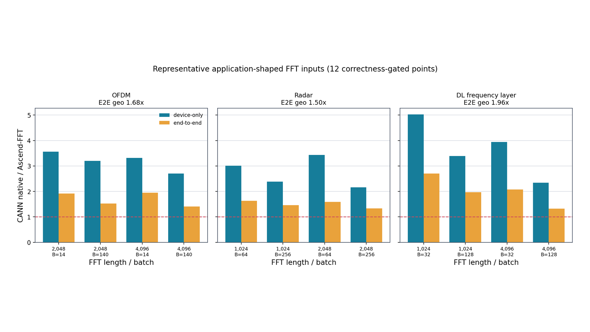

# 当前实验结果

> **发布快照**：Ascend910_9382（48 AIV），CANN 9.0.0，fp32，前向 C2C。
> 所有主结论来自同一份 correctness-gated snapshot；完整协议见[测量方法](methodology.md)。

| 实验问题 | 严格基线 | 覆盖 | 几何均值 | 胜出点 |
|---|---|---:|---:|---:|
| kernel/device 区间是否更快 | CANN 原生 C2C（`torch_npu`） | 49 | **3.01x** | **49/49** |
| 收益能否传到 host-to-host 路径 | 同上，pinned H2D + FFT + D2H | 49 | **1.66x** | **46/49** |
| 代表应用 shape 是否保持趋势 | 同上，OFDM / 雷达 / DL 频域层 | 12 | **1.70x** | **12/12** |

这里的 speedup 统一定义为 `CANN native latency / Ascend-FFT latency`，大于 1 表示
Ascend-FFT 更快。结果说明当前 C2C kernel 优势覆盖整个发布网格，但端到端收益受设备区间之外的
时间限制。下面按实验目的展开，不用原始长表承担主要叙事。

## 1. 优势覆盖哪些长度与 batch

49 个 `(N, batch)` 点全部超过 1，范围为 **1.04x..6.86x**。优势最大的区域是中小长度与
尚未饱和的 batch；最接近持平的点是 `N=1024, batch=4096`。因此 `3.01x` 是固定网格的几何
均值，不代表每个点都有三倍收益，也没有通过追加有利 shape 改写平均值。

绝对延迟图补充了 speedup 图看不到的量级：

## 2. 收益如何随规模变化

小 batch 时，CANN 原生路径的固定调度成本占比更高，Ascend-FFT 的优势更明显；batch 增长后，
双方都进入持续吞吐区，倍率通常收窄。即使如此，本快照中所有 C2C device-only 点仍保持领先。
这张图用于识别拐点，不能单独证明跨硬件或超出发布长度的泛化。

## 3. Kernel 收益能否成为端到端收益

端到端路径包括 pinned H2D、一次前向 C2C 和 D2H。**46/49** 个点领先，三个回退点为：

| N | Batch | E2E speedup |
|---:|---:|---:|
| 1024 | 4096 | 0.954x |
| 2048 | 4096 | 0.990x |
| 4096 | 1024 | 0.978x |

第三个面板的 `1 - device/end-to-end` 在全网格约为 **61.8%..83.1%**。它表示独立计时中
设备区间之外的总份额，包含搬运与同步，不能进一步解释为精确的 H2D/D2H 分项，也不是 overlap
测量。它说明 kernel 加速不会按原倍率直接传到 host-to-host 应用路径。

## 4. 代表应用 shape 是否改变结论

三类 shape 都保持端到端领先：OFDM、雷达和深度学习频域层的 E2E 几何均值分别为
**1.68x、1.50x、1.96x**。这些分组按 `scripts/e2e_test.py` 中公开的 shape 集合从旧格式 JSON
恢复，因为该 JSON 没有逐行保存 `app` 名称；12 个 shape 与发布 manifest 一致。

这仍然是**代表应用输入上的 FFT 路径**，不等价于完整通信、雷达或神经网络应用加速；应用前后处理
不在计时区内。

## 5. 成本模型在哪些区域偏离

在现有 49 点校准网格上，平均绝对偏差为 **7.7%**，**43/49** 个点位于 +/-15% 内。右侧残差图
显示高估和低估集中在哪些 `(N, batch)` 区域，比单一平均误差更适合指导下一轮补点。

这项结果是**校准网格一致性检查**，不是独立留出集、LOO 或跨硬件泛化证据。模型用于候选预排序，
最终 Plan 仍需要实测回填；独立验证集已列入[未来计划](../roadmap.md)。

## 6. 其他基线提供什么信息

多基线图用于解释量级，不用于生成一个混合“总排名”：

- CANN 原生 C2C 是同设备、同精度、同变换语义的严格基线。
- NumPy / PyTorch CPU 结果受不同硬件与共享宿主负载影响，只提供系统上下文。
- `aclRfft1D` 是 R2C，不具备与 C2C 相同的语义和搬运量，只作调用路径参照。
- `v1` 展示项目内部演进，不是外部专业库。

## 7. 当前证据边界

R2C/C2R 已有实现和历史测量，但旧 JSON 缺少现行发布器要求的逐行正确性、环境和 trial 字段，且
确实包含小于 1 的 shape。因此它们不再进入本页总览或 README 几何均值。按新协议重采、展示完整
胜/平/负热图后，才能升级为当前发布证据。支持状态与性能证据是两件事，分别见
[支持范围](../reference/support.md)和[未来计划](../roadmap.md)。

## 原始数据与复现

- [C2C 49 点矩阵](../generated/matrix.md)
- [多基线完整明细](../generated/comparison.md)
- [端到端发布数据](https://github.com/TruNcat3/ascend-fft/blob/master/results/published/ascend910_9382-cann9.0.0/e2e.json)
- [应用 shape 发布数据](https://github.com/TruNcat3/ascend-fft/blob/master/results/published/ascend910_9382-cann9.0.0/e2e_app.json)
- [发布 manifest](https://github.com/TruNcat3/ascend-fft/blob/master/results/published/ascend910_9382-cann9.0.0/manifest.json)
- [图表生成器](https://github.com/TruNcat3/ascend-fft/blob/master/scripts/plot_results.py)

图、摘要和原始数据必须来自同一发布快照；禁止从不同日期、硬件或协议的文件拼接结论。
