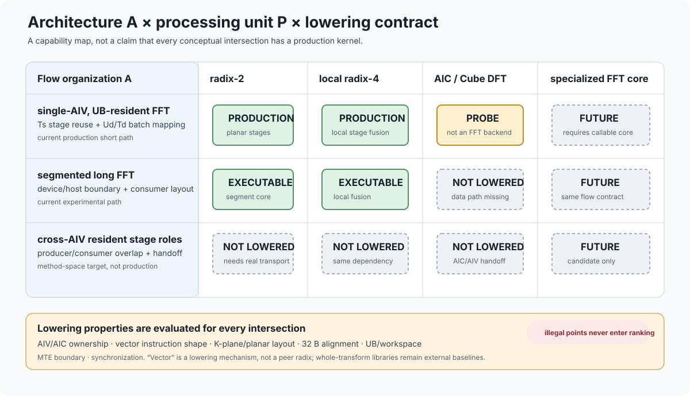
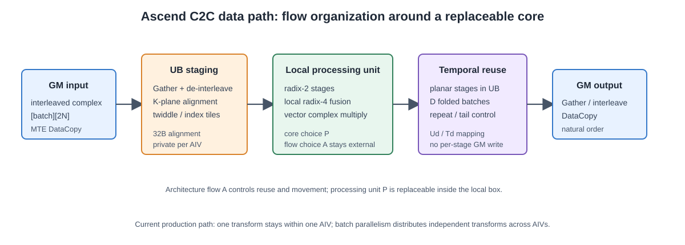

# 架构与硬件映射

本库继承 [cuButterfly](https://github.com/TruNcat3/cuButterfly) 的阶段/数据二维空间-时间映射方法，在 Ascend 上重新实现其物理数据通路。它不是 CUDA kernel 的翻译版。先读 [设计动机](motivation.md)，再用本页对应概念、代码和当前实现边界。

本页的映射抽象、A/P 分层和“流优化与核心优化应分开归因”的分析来自 cuButterfly；Ascend-FFT
负责把该抽象落实为 Ascend 的硬件 profile、AIV/UB/MTE/GM lowering、可执行 manifest 和实测
证据。因而图中的方法层结论应与 cuButterfly 一起引用，平台层实现结论则以本仓库的代码和归档为准。

## 从方法到实现

```text
FFT 依赖图 + 长度/batch/数值语义
                 ↓
阶段/数据空间展开与时间复用 + 布局/驻留/流水
                 ↓
硬件可行性约束 + 计算核心选型 + 成本估计
                 ↓
Plan：索引/系数生成与上传、缓冲准备、执行与实测
                 ↓
Ascend lowering：AIV 矢量指令 / 私有 UB / MTE 搬运
```

“架构映射”说明资源怎样组织与复用；“计算核心选型”说明其中执行哪种蝶形算术；“lowering”说明该核心如何合法地使用指令、布局和同步。三者分层，但资源成本相互影响，必须共同筛选。

## 两个正交设计轴

```text
                         计算核心 P
             radix-2   radix-4   vector   Cube/专用 core
                 │         │         │            │
流编排 A ────────┼─────────┼─────────┼────────────┼──→ 合法候选
 (Us,Ts,Ud,Td,   │         │         │            │
  分段/layout/   │         │         │            │
  residence/    │         │         │            │
  pipeline)     │         │         │            │
```

图中的每个交点都是一个潜在设计点，而不是“换一个核心就自动得到更好的实现”。交点只有在
以下条件同时满足时才可执行：局部核心能处理该块、数据布局和对齐合法、UB/workspace 足够、
阶段依赖和跨 AIV 交接有真实同步/所有权方案。`query_lowering()` 的职责就是把“抽象上可行”
与“仓库中已有可执行 lowering”分开；未实现的交点必须返回 `not-lowered`，不能进入性能排序。

这也规定了实验归因方式：

| 实验 | 固定项 | 改变项 | 结论能说明什么 |
|---|---|---|---|
| 流编排消融 | 同一个 radix/局部核心、相同语义 | 分段、时空展开、layout、boundary、pipeline | 流优化是否减少边界、等待或搬运 |
| 核心消融 | 同一个流编排和资源预算 | radix/向量/Cube/专用核心 | 局部算术单元的收益与代价 |
| 联合搜索 | 合法候选集合 | `A × P` 中的多个交点 | 硬件上最终应部署哪个组合，但不能单独归因 |

当前 Ascend-FFT 的 radix-2/局部 radix-4 是 `P` 轴上的一个已落地组合；长 FFT 的 separate/fused
边界、分段和设备交接属于 `A` 轴。后续加入更快的局部核心不会取代这套架构，反而可以作为同一
流编排中的新候选进行比较。

<figure class="doc-diagram">
  <a href="../figures/flow_core_space.svg">
    
  </a>
  <figcaption>
    `A × P` 交点必须经过 lowering contract。图中特别把向量指令、布局和所有权列为 lowering 属性，
    不再把 vector 与 radix 错画成同一级算术核心。
    <span class="doc-diagram__links"><a href="../figures/flow_core_space.svg">SVG</a> ·
    <a href="../figures/flow_core_space.pdf">PDF</a></span>
  </figcaption>
</figure>

图的组织方式承接 [cuButterfly 概念图](https://github.com/TruNcat3/cuButterfly/blob/master/figures/cubutterfly_concept.svg)
和其 `D × S → Ud/Td/Us/Ts → hardware realization` 设计总览；这里把 GPU 的 grid/CTA/warp
节点替换为 Ascend 的 AIV/UB/MTE/GM，并把未实现的跨 AIV 阶段角色明确标为 `NOT LOWERED`。

## 当前生产数据通路

```text
GM 交错复数输入
   → DataCopy 到 UB
   → Gather：位反转、去交错、K-plane 布局
   → 平面级局部 radix-4 / radix-2
   → Gather：转为 planar 布局
   → planar radix-2 阶段（独立组折入 repeat）
   → Gather：交错输出
   → DataCopy 回 GM
```

整个 c2c transform 的中间值在单个 AIV 的 UB 中，不是每一级都写回 GM。多个 AIV 分配独立 batch；单个 AIV 按组循环处理其余批次。满足 repeat、步长和并发约束时，D 个 batch 可共同形成矢量指令工作组。D 的作用是减少重复发射，而不是证明 MTE 与全部计算已经流水重叠。

<figure class="doc-diagram">
  <a href="../figures/ascend_data_path_detail.svg">
    
  </a>
  <figcaption>
    当前实现不是“核心计算结束后再做时间复用”：`Ts` 包围 UB 内的依赖阶段循环，`Td` 包围完整
    transform 服务，局部 radix 只是循环内部的可替换位置。右侧逐级写回仅为说明代价的反例。
    <span class="doc-diagram__links"><a href="../figures/ascend_data_path_detail.svg">SVG</a> ·
    <a href="../figures/ascend_data_path_detail.pdf">PDF</a></span>
  </figcaption>
</figure>

## 框架对象不是七套独立算法

| 对象 | 职责 | 主要代码 |
|---|---|---|
| H / Hardware | 设备资源与指令约束 | `objects.hpp`、硬件 profile |
| G / Generator | 旋转因子、位反转和布局索引 | `reference.cpp` |
| A / Mapping | 核数、数据循环、局部交换等映射 | `objects.hpp` |
| P / StagePlan | radix、阶段融合和 UB 可行性 | `objects.hpp` |
| L / Layout | 输入输出表示与连续性 | `objects.hpp` |
| F / Fusion | 蝶形/阶段融合候选描述 | `objects.hpp` |
| Q / Metric | 模型成本、实测成本和误差 | `objects.hpp` |

接口定义见 [objects.hpp](https://github.com/TruNcat3/ascend-fft/blob/master/include/butterfly/objects.hpp) 和 [plan.hpp](https://github.com/TruNcat3/ascend-fft/blob/master/include/butterfly/plan.hpp)。枚举中存在的字段不等于已有独立高效 kernel；当前可执行候选受实际实现和验收约束。`Mapping.ts/us` 的现有编码也不等同于方法层 Ts/Us 的展开计数，不能仅凭字段名称推断流水结构。

## 硬件约束怎样影响映射

以下是仓库验证设备 Ascend910_9382 的配置/探针结论，不是所有 Ascend 型号的通用常量。

| 约束 | 对设计的影响 |
|---|---|
| 48 AIV、每核私有 UB 196608 B | batch 分核；缓冲容量限制长度与融合范围 |
| 当前工具链/设备路径无可用 SIMT | 不使用 CUDA warp shuffle 作为局部交换机制 |
| 矢量 UB 偏移要求 32 B 对齐 | 小配对距离需 K-plane 重排，不能直接发任意偏移矢量指令 |
| 已验证 Level-0 fp32 mask 上限 64、repeat 上限 255 | lane/repeat/批折叠必须分片与钳制；profile 的 128-lane 字段不代表本指令可用 mask |
| UB 不跨 AIV 共享，跨核数据经 GM | 同步标志不能替代数据传输；跨核阶段角色需要额外交接设计 |
| Cube 使用独立 AIC 数据通路 | 不能在纯 AIV kernel 中简单替换一条蝶形指令成 Mmad |

换设备先运行 [硬件探针](https://github.com/TruNcat3/ascend-fft/blob/master/scripts/hw_probe.sh)，再审核 [profile](https://github.com/TruNcat3/ascend-fft/blob/master/config/ascend910_93_profile.json)、模型与合法候选。当前 profile 有历史字段，不能仅靠加载 JSON 就认为完成自动校准。

## 当前实现与方法空间的边界

| 能力 | 当前状态 |
|---|---|
| 单核片上阶段时间复用 | c2c 生产路径已实现 |
| batch 数据空间并行与单核时间遍历 | 已实现 |
| 小长度批折叠 D、K-plane 布局选型 | 已实现，受步长/repeat/并发约束 |
| 局部 radix-4 与 radix-2 混合 | 已实现；不是任意高 radix 的通用 lowering |
| 独立阶段角色跨 AIV 驻留并重叠 | 尚未形成生产 FFT 路径 |
| AIC Cube 与 AIV 联合 FFT 流水 | 仅有 Cube 探针，尚未实现完整 FFT |
| 任意长度、跨卡、其他蝶形算子 | 不在当前已验证生产覆盖中 |

大 batch 能提升活跃核利用率、摊销固定开销，但在硬件饱和后，吞吐由每组指令、交换和搬运成本决定。不能据此承诺规模越大越领先。

下一页：[计算核心与合法实现](kernels.md)；实数布局见 [r2c/c2r](real-transforms.md)，性能证据见 [实验结果](../benchmarks/results.md)，计时协议见 [测试方法](../benchmarks/methodology.md)。
