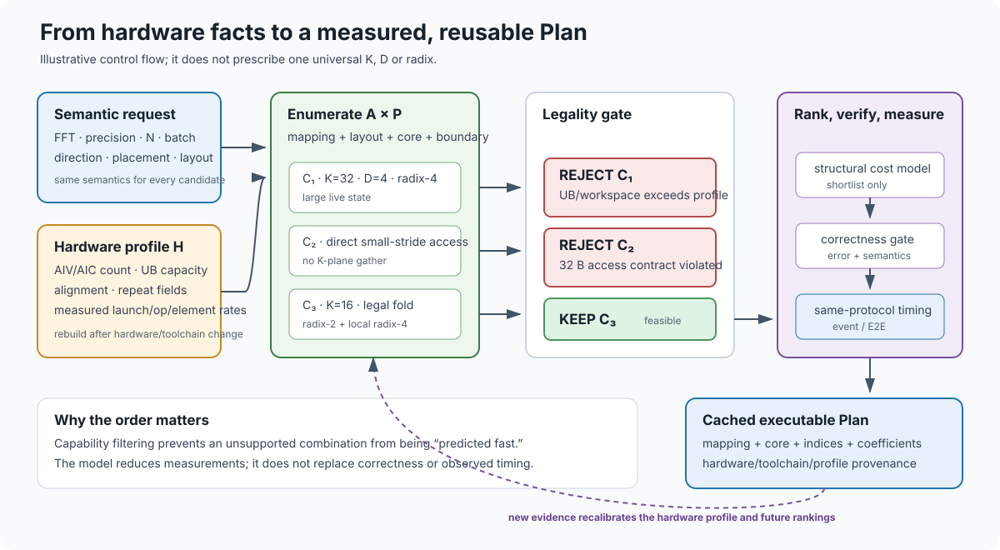

# 性能模型与选型

模型服务于 [空间-时间映射](motivation.md) 的候选排序。当前实现是“结构计数 + 实测系数”的校准成本模型，不是纯黑箱逐点查表，也不是无需测量的硬件无关理论。

## 参数怎样进入成本

`estimate()` 根据长度、batch、核数、K-plane、折叠和融合路径，统计矢量算子发射数 `#op` 与元素访问数 `#elem`。概念成本为：



模型只对通过硬件和 lowering 合约的 `A × P` 候选排序；profile 用于校准和解释，最终 Plan 仍
必须通过正确性与实测门禁。

```text
eta_us = launch_us
       + iters × (op_ns × #op + elem_ns × #elem) / 1000
```

`iters` 反映每个活跃核承担的工作组数，折叠路径改变组数和每组计数。算子数必须按当前 kernel 的实际分支统计，不能沿用优化前的常数：修改复数乘、repeat 折组或 radix 融合后，原模型即可能选错 K。

模型里的元素访问项不是把所有 UB 操作都当作 HBM 流量；GM、局部发射和重排的详细瓶颈仍需 profile 解释。模型也没有完整表达跨核角色流水、Cube 数据通路或任意启动重叠，未实现的架构不能套用这个公式声称性能可预测。

## 可行性先于速度排序

| 候选状态 | 含义 |
|---|---|
| Infeasible | 违反资源、指令或实现约束，不执行 |
| Unverified | 尚未通过正确性验证，不作为已验证最优 |
| Feasible | 已通过验收，可按模型排序 |
| Measured | 已回填实测时间与误差，优先于仅模型结果 |

排序在同状态内使用成本值；`Plan::measure()` 验证后回填实测结果。旋转因子是否驻留、交换方式、radix 范围、UB 容量和输出对齐均属于合法性契约。候选描述多于实际实现时，必须由枚举/验收排除，而不是默认字段已被 kernel 消费。

## 校准与证据边界

当前 `launchUs`、`opNs`、`elemNs` 系数来自既有网格上的加权最小二乘校准，采用 `1/y` 加权以减少大点对相对误差的支配。它可以检验结构计数与实测的关系，但不能仅凭训练网格拟合证明新硬件/新算子泛化。

换设备时应先探测资源和指令约束，再测典型发射、搬运与负载规模，校准系数并在未参与校准的点上验证排序。**当前脚本不是自动安装即完成这一流程**：探针结论需审核回填，校准脚本输出也需与代码同步。

```bash
scripts/hw_probe.sh
python3 scripts/calib_eta.py --help
scripts/repro.sh matrix
```

实现见 [butterfly.cpp](https://github.com/TruNcat3/ascend-fft/blob/master/src/framework/butterfly.cpp)，候选状态见 [enumerate.hpp](https://github.com/TruNcat3/ascend-fft/blob/master/include/butterfly/enumerate.hpp)。复现实验使用仓库 [统一入口](https://github.com/TruNcat3/ascend-fft/blob/master/scripts/repro.sh)，实际性能结论见 [实验结果](../benchmarks/results.md)，计时边界见 [测试方法](../benchmarks/methodology.md)。

## 当前限制

- 已验证设备/长度之外不沿用校准系数作为保证；小 batch 的启动噪声尤其敏感。
- batch 折叠既减少发射，也可能减少活跃工作组，模型与合法性判断必须共同考虑。
- 理论上更大的设计空间不等于当前候选搜索已经穷尽；模型选优与实测最优应分别报告。
- 当前模型未完整建模多角色流水和 Cube lowering；这些是扩展方向，不是既有成果。
