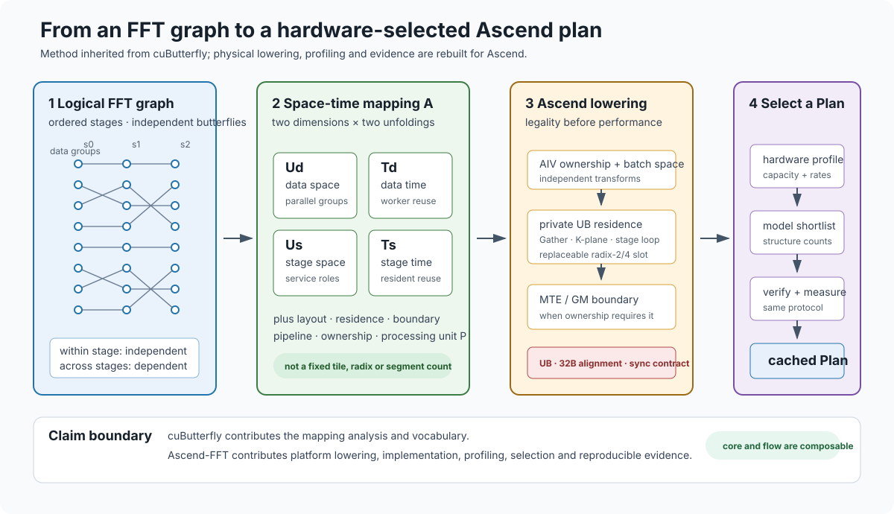

# 文档入口

Ascend-FFT 是面向 Ascend NPU 的高性能 FFT 算子库与跨平台方法实践。它以统一 Plan、参数化设计空间和硬件实测选型为基础，目标是逐步覆盖不同精度、长度、批量、变换语义和 Ascend 硬件。当前发布版的已验证范围单独记录在[支持范围](reference/support.md)，不作为项目的最终边界。文档按任务组织；历史探索不是使用本库的前置条件。

它是 [cuButterfly](https://github.com/TruNcat3/cuButterfly) 混合空间-时间映射方法的 Ascend 迁移实例：继承架构范式，但针对 AIV、UB、MTE 和 GM 独立实现物理 lowering，不复用 CUDA kernel。

<figure class="doc-diagram">
  
  <figcaption>
    阅读顺序：FFT 依赖图 → 二维空间/时间映射 → Ascend AIV/UB/MTE/GM lowering →
    profile、模型与实测共同选择 Plan。点击可查看可编辑 SVG；
    <a href="figures/method_layers.pdf">PDF</a> ·
    <a href="design/motivation/">设计动机</a> ·
    <a href="design/architecture/">架构细化</a>。
  </figcaption>
</figure>

图示的二维展开和反馈闭环借鉴 [cuButterfly 的概念图与设计总览](https://github.com/TruNcat3/cuButterfly/blob/master/figures/cubutterfly_concept.svg)，
但本页节点已特例化为 FFT、AIV、UB、MTE、GM 和 Ascend 的 lowering 状态；图中标注的生产、探针和未来状态以本仓库代码与证据为准。

<figure class="doc-diagram doc-diagram--compact">
  
  <figcaption>
    历史发布快照的性能摘要，数值门禁与来源记录加固后待重新验证；完整点数、协议、胜平负和限制见
    <a href="benchmarks/results/">实验结果</a>。这张图是测量结果，不代表跨硬件或未验证长度的保证。
  </figcaption>
</figure>

  
  

    <strong>Teng Wang</strong> 
    High Efficient Intelligent Computing Lab 
    <a href="https://sz.ustc.edu.cn/en/index.html">Suzhou Institute for Advanced Research,
    University of Science and Technology of China</a> 
    Suzhou, China · <a href="mailto:wangt635@ustc.edu.cn">wangt635@ustc.edu.cn</a>
  

本项目由作者独立维护；机构名称与标识用于说明研究归属，不表示学校或研究院对项目作官方背书。
[项目与作者](about.md)记录完整归属、联系和标识使用说明。

## 使用库

1. [安装与环境检查](getting-started/installation.md)：准备工具链，构建并验证。
2. [快速开始](getting-started/quickstart.md)：检查三种变换，再调用 C++ API。
3. [变换与数据布局](user-guide/transforms.md)：确认长度、布局和归一化。
4. [Plan 与选型](user-guide/plans.md)：复用计划，区分选型成本与执行成本。

参考：[API](reference/api.md) · [配置](reference/configuration.md) · [支持范围](reference/support.md) · [故障排查](reference/troubleshooting.md) · [术语](reference/glossary.md)。

## 理解方法

[设计动机](design/motivation.md) → [架构与映射](design/architecture.md) → [计算核心](design/kernels.md)与[性能模型](design/performance-model.md)。实数链路单独见[实数变换实现](design/real-transforms.md)。

## 阅读与复现实验

先读[实验协议](benchmarks/methodology.md)，再看[当前结果](benchmarks/results.md)。[复现实验](benchmarks/reproducibility.md)提供命令与来源；[相关工作与基线](benchmarks/related-work.md)区分同卡比较和跨硬件公开数据。

## 修改工程

[工程结构](development/repository-layout.md) → [增加设计点](development/adding-design-points.md) → [验证与发布](development/validation-and-release.md)。定位瓶颈时查阅[profiling](development/profiling.md)。

## 后续方向

[未来计划与验收](roadmap.md)按工程闭环、算子能力、性能研究和跨硬件验证列出当前缺口、交付内容与验收证据，区分项目目标和已验证成果。

## 文档边界

- 当前是 C++ API，尚无稳定 C ABI或用户指定stream的异步执行接口。
- 已验证硬件和长度见[支持范围](reference/support.md)；换SoC不等于只改一个名称。
- 实验结论适用于记录的硬件、变换与协议。旧过程见[历史归档](archive/decisions.md)，不作为现行API说明。
