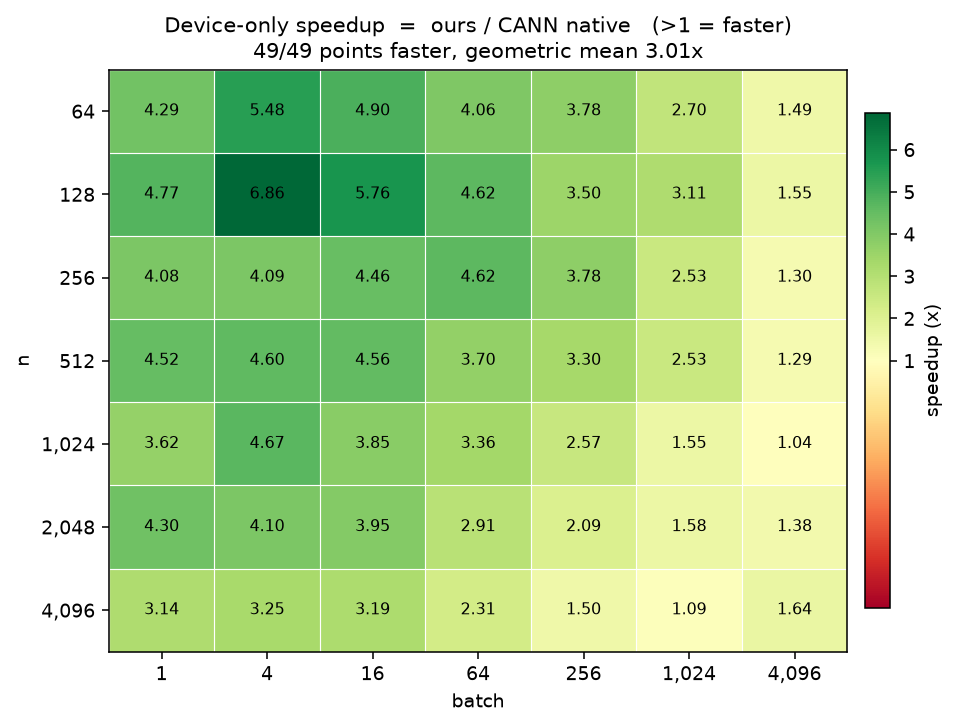
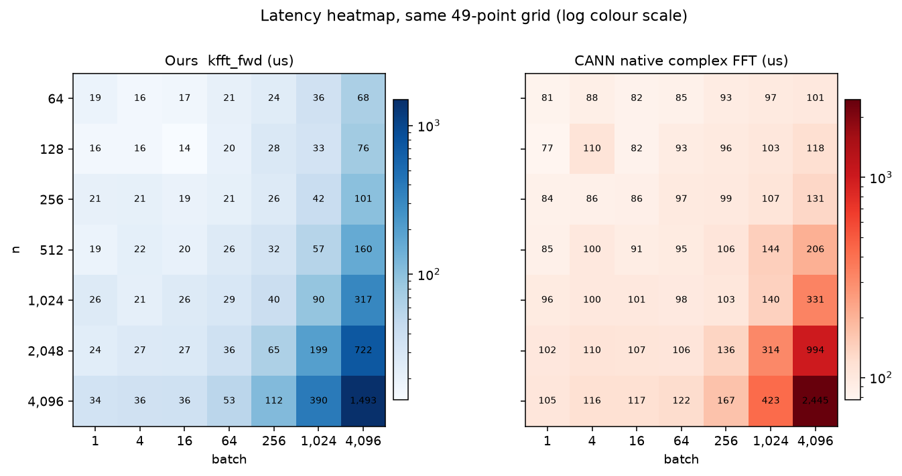
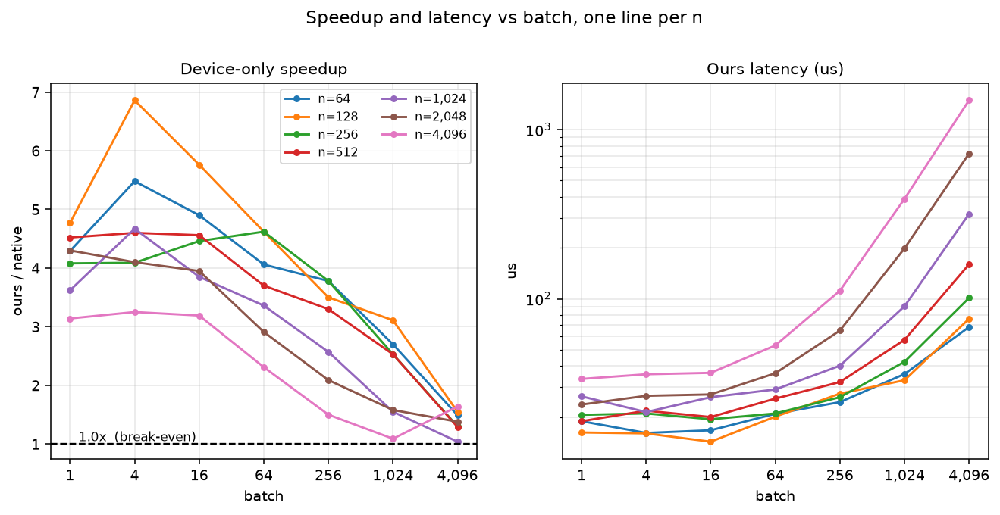
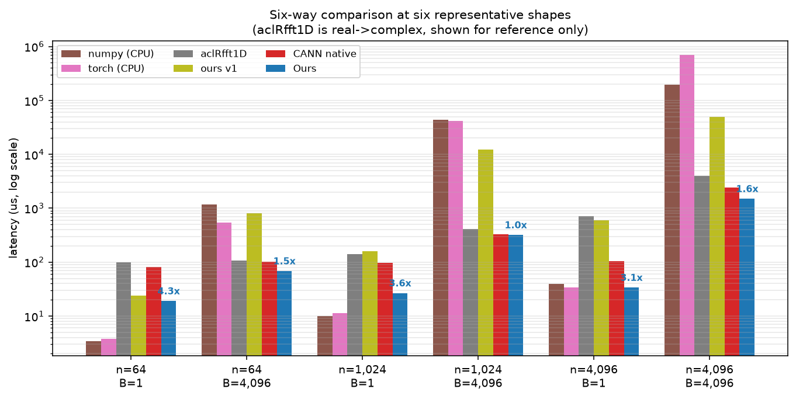
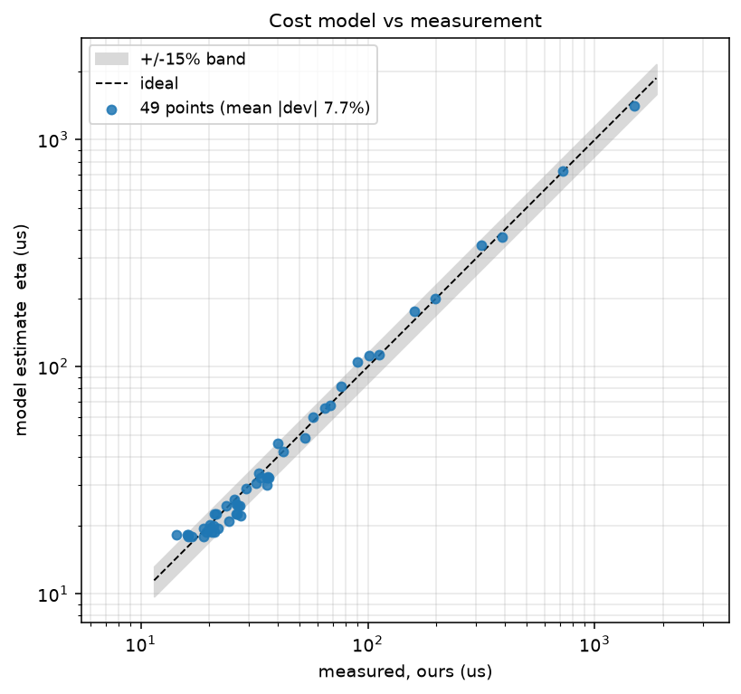
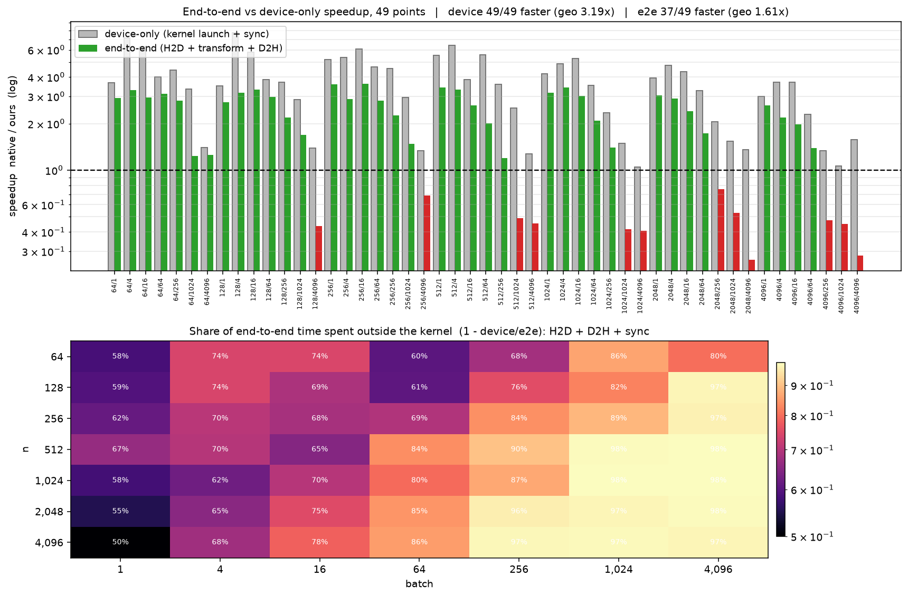

# 实验对比（图 + 详表）

> 表格读起来费劲，本文把同样的数据画成图；图由 `scripts/plot_results.py` 从已有表格/JSON 生成，**不重复测量**。数字口径与 [`matrix_test_a7.md`](matrix_test_a7.md)、[`性能对比-标准库vs自研.md`](性能对比-标准库vs自研.md)、`results/e2e.json` 完全一致。

| 想看什么 | 直接跳 |
|---|---|
| 一眼看谁快 | [图1](#图1-49-点-speedup-热力图) |
| 绝对延迟多少 | [图2](#图2-延迟热力图) |
| batch 变大怎么变 | [图3](#图3-speedup-与延迟随-batch-缩放) |
| 和 numpy/torch 等比 | [图4](#图4-六基线同场对比) |
| 成本模型准不准 | [图5](#图5-成本模型--vs-实测) |
| 真实搬运数据后还快吗 | [图6](#图6-端到端测试) |

---

## 0　实验设置

| 项 | 值 |
|---|---|
| 硬件 | Ascend910_9382，48 AIV，UB 196608 B |
| 软件 | CANN 9.0.0（`ccec` + `libascendcl`），torch_npu 2.10.0 |
| 参考 | 双精度 CPU DIT，判据 `maxRel ≤ 1e-4` |
| 网格 | `n ∈ [64, 128, 256, 512, 1024, 2048, 4096]` × `batch ∈ [1, 4, 16, 64, 256, 1024, 4096]`，共 49 点 |
| 统计 | `--rounds 3` 逐点 **min-of-means**（自研与原生同口径） |
| 宿主 | `nproc=1`、`loadavg≈24` —— CPU 基线有 ±15% 抖动，NPU 列抖动较小 |

**比值定义**：`速度比 = 原生耗时 ÷ 自研耗时`，**>1 表示自研更快**。

**两种口径**：
- **device-only**：只计 kernel 发射 + 同步（含 launch 开销），不含数据搬运；
- **端到端 E2E**：H2D + 变换 + D2H，不含进程启动与输入生成。

---

## 图1　49 点 speedup 热力图



**49/49 个点自研更快**（几何均值 **3.01×**，最紧 **1.04×** @ `n=1024/B=4096`，最好 **6.86×** @ `n=128/B=4`）。

**形状趋势**：颜色随 `batch` 增大由绿转黄 —— 小/中 batch 是自研的强区（3~7×），大 batch（≥1024）两侧都逼近各自的访存上限，差距收窄到 1.0~1.6×。`n=4096/B=4096` 的 1.64× 是**在带宽受限区仍然赢**的点（原生 2444.7 vs 自研 1492.7 µs）。

### 表1　49 点详表（含迷你条，条越长越快）

| n | batch | 自研 (µs) | 原生 (µs) | 速度比 | 分布 | η (µs) | η 偏差 | maxRel |
|---:|---:|---:|---:|---:|:---|---:|---:|:---|
| 64 | 1 | 18.9 | 81.1 | **4.29×** | `██████████████░░░░` | 17.8 | -5.8% | 5.24e-08 |
| 64 | 4 | 16.1 | 88.3 | **5.48×** | `████████████████░░` | 17.8 | +10.6% | 7.05e-08 |
| 64 | 16 | 16.7 | 81.9 | **4.90×** | `███████████████░░░` | 17.8 | +6.6% | 1.11e-07 |
| 64 | 64 | 20.9 | 84.8 | **4.06×** | `█████████████░░░░░` | 20.0 | -4.3% | 1.14e-07 |
| 64 | 256 | 24.5 | 92.6 | **3.78×** | `████████████░░░░░░` | 20.8 | -15.1% | 1.64e-07 |
| 64 | 1024 | 35.9 | 97.0 | **2.70×** | `█████████░░░░░░░░░` | 30.1 | -16.2% | 2.24e-07 |
| 64 | 4096 | 68.1 | 101.2 | **1.49×** | `███░░░░░░░░░░░░░░░` | 67.4 | -1.0% | 2.34e-07 |
| 128 | 1 | 16.2 | 77.3 | **4.77×** | `███████████████░░░` | 18.1 | +11.7% | 7.41e-08 |
| 128 | 4 | 16.0 | 109.7 | **6.86×** | `██████████████████` | 18.1 | +13.1% | 1.22e-07 |
| 128 | 16 | 14.3 | 82.4 | **5.76×** | `████████████████░░` | 18.1 | +26.6% | 1.22e-07 |
| 128 | 64 | 20.1 | 92.8 | **4.62×** | `██████████████░░░░` | 20.1 | +0.0% | 1.49e-07 |
| 128 | 256 | 27.5 | 96.2 | **3.50×** | `████████████░░░░░░` | 22.1 | -19.6% | 1.63e-07 |
| 128 | 1024 | 33.0 | 102.7 | **3.11×** | `██████████░░░░░░░░` | 33.9 | +2.7% | 2.34e-07 |
| 128 | 4096 | 76.2 | 118.2 | **1.55×** | `████░░░░░░░░░░░░░░` | 81.5 | +7.0% | 2.44e-07 |
| 256 | 1 | 20.6 | 84.1 | **4.08×** | `█████████████░░░░░` | 18.6 | -9.7% | 9.33e-08 |
| 256 | 4 | 21.0 | 85.9 | **4.09×** | `█████████████░░░░░` | 18.6 | -11.4% | 9.33e-08 |
| 256 | 16 | 19.4 | 86.5 | **4.46×** | `██████████████░░░░` | 18.6 | -4.1% | 1.96e-07 |
| 256 | 64 | 21.0 | 97.0 | **4.62×** | `██████████████░░░░` | 22.4 | +6.7% | 2.04e-07 |
| 256 | 256 | 26.2 | 99.0 | **3.78×** | `████████████░░░░░░` | 24.8 | -5.3% | 2.29e-07 |
| 256 | 1024 | 42.4 | 107.1 | **2.53×** | `████████░░░░░░░░░░` | 42.2 | -0.5% | 2.35e-07 |
| 256 | 4096 | 101.2 | 131.3 | **1.30×** | `██░░░░░░░░░░░░░░░░` | 111.6 | +10.3% | 2.38e-07 |
| 512 | 1 | 18.9 | 85.4 | **4.52×** | `██████████████░░░░` | 19.4 | +2.6% | 9.06e-08 |
| 512 | 4 | 21.8 | 100.2 | **4.60×** | `██████████████░░░░` | 19.4 | -11.0% | 1.15e-07 |
| 512 | 16 | 20.0 | 91.2 | **4.56×** | `██████████████░░░░` | 19.4 | -3.0% | 1.88e-07 |
| 512 | 64 | 25.7 | 95.1 | **3.70×** | `████████████░░░░░░` | 25.9 | +0.8% | 1.88e-07 |
| 512 | 256 | 32.2 | 106.4 | **3.30×** | `███████████░░░░░░░` | 30.6 | -5.0% | 2.26e-07 |
| 512 | 1024 | 57.2 | 144.5 | **2.53×** | `████████░░░░░░░░░░` | 59.7 | +4.4% | 2.35e-07 |
| 512 | 4096 | 159.9 | 206.5 | **1.29×** | `██░░░░░░░░░░░░░░░░` | 176.0 | +10.1% | 2.41e-07 |
| 1024 | 1 | 26.5 | 95.8 | **3.62×** | `████████████░░░░░░` | 22.5 | -15.1% | 6.72e-08 |
| 1024 | 4 | 21.4 | 99.9 | **4.67×** | `██████████████░░░░` | 22.5 | +5.1% | 1.13e-07 |
| 1024 | 16 | 26.2 | 101.0 | **3.85×** | `████████████░░░░░░` | 22.5 | -14.1% | 1.28e-07 |
| 1024 | 64 | 29.1 | 97.8 | **3.36×** | `███████████░░░░░░░` | 29.0 | -0.3% | 2.33e-07 |
| 1024 | 256 | 40.2 | 103.3 | **2.57×** | `█████████░░░░░░░░░` | 45.7 | +13.7% | 2.33e-07 |
| 1024 | 1024 | 90.3 | 140.1 | **1.55×** | `████░░░░░░░░░░░░░░` | 104.9 | +16.2% | 2.33e-07 |
| 1024 | 4096 | 317.4 | 330.7 | **1.04×** | `█░░░░░░░░░░░░░░░░░` | 341.6 | +7.6% | 2.36e-07 |
| 2048 | 1 | 23.7 | 102.0 | **4.30×** | `██████████████░░░░` | 24.4 | +3.0% | 4.52e-08 |
| 2048 | 4 | 26.7 | 109.5 | **4.10×** | `█████████████░░░░░` | 24.4 | -8.6% | 1.18e-07 |
| 2048 | 16 | 27.2 | 107.4 | **3.95×** | `█████████████░░░░░` | 24.4 | -10.3% | 1.18e-07 |
| 2048 | 64 | 36.3 | 105.6 | **2.91×** | `██████████░░░░░░░░` | 32.7 | -9.9% | 1.90e-07 |
| 2048 | 256 | 64.9 | 135.5 | **2.09×** | `███████░░░░░░░░░░░` | 65.9 | +1.5% | 2.36e-07 |
| 2048 | 1024 | 198.6 | 314.2 | **1.58×** | `████░░░░░░░░░░░░░░` | 198.8 | +0.1% | 2.36e-07 |
| 2048 | 4096 | 722.3 | 993.5 | **1.38×** | `███░░░░░░░░░░░░░░░` | 730.2 | +1.1% | 2.38e-07 |
| 4096 | 1 | 33.6 | 105.4 | **3.14×** | `███████████░░░░░░░` | 32.3 | -3.9% | 1.06e-07 |
| 4096 | 4 | 35.8 | 116.5 | **3.25×** | `███████████░░░░░░░` | 32.3 | -9.8% | 1.35e-07 |
| 4096 | 16 | 36.5 | 116.6 | **3.19×** | `███████████░░░░░░░` | 32.3 | -11.5% | 1.35e-07 |
| 4096 | 64 | 53.0 | 122.5 | **2.31×** | `████████░░░░░░░░░░` | 48.5 | -8.5% | 2.05e-07 |
| 4096 | 256 | 111.6 | 166.9 | **1.50×** | `███░░░░░░░░░░░░░░░` | 113.2 | +1.4% | 2.26e-07 |
| 4096 | 1024 | 390.0 | 423.3 | **1.09×** | `█░░░░░░░░░░░░░░░░░` | 372.1 | -4.6% | 2.36e-07 |
| 4096 | 4096 | 1,492.7 | 2,444.7 | **1.64×** | `████░░░░░░░░░░░░░░` | 1,407.8 | -5.7% | 2.41e-07 |

---

## 图2　延迟热力图



同一份数据的**绝对值**视角：左图自研、右图原生，共用对数色标。原生那一侧整片偏红且几乎不随 `n` 变（81→2445 µs 中，`B=1` 一行稳定在 77~105 µs —— 是**固定 launch/调度开销**），自研那一侧 `B≤64` 全在 14~53 µs，说明自研把固定开销压下去了。

---

## 图3　speedup 与延迟随 batch 缩放



左图每条线是一个 `n`：**7 条线全部在 1.0× 虚线之上**，且整体从 `B=4` 的 4~7× 单调下滑到 `B=4096` 的 1.0~1.6×。右图是自研绝对延迟（对数轴），`B≤64` 几乎是平的 —— 这个区间被固定开销主导，`B>64` 才开始随 batch 线性上升。

---

## 图4　六基线同场对比



取 6 个代表形状，6 根柱子同场（对数轴）。柱顶蓝色标注是 **原生 ÷ 自研**（>1 = 自研更快）。

### 表2　代表形状的六基线数值（µs）

| n | batch | numpy (CPU) | torch (CPU) | CANN 原生 | aclRfft1D | 自研 v1 | **自研当前** | ÷原生 | ÷numpy | ÷torch |
|---:|---:|---:|---:|---:|---:|---:|---:|---:|---:|---:|
| 64 | 1 | 3.4 | 3.8 | 81.1 | 98.7 | 24.0 | **18.9** | **4.29×** | 0.18× | 0.20× |
| 64 | 4096 | 1,165.2 | 543.7 | 101.2 | 106.9 | 816.9 | **68.1** | **1.49×** | 17.11× | 7.98× |
| 1024 | 1 | 10.1 | 11.3 | 95.8 | 139.6 | 158.7 | **26.5** | **3.62×** | 0.38× | 0.43× |
| 1024 | 4096 | 43,923.3 | 41,975.8 | 330.7 | 416.2 | 12,315.9 | **317.4** | **1.04×** | 138.38× | 132.25× |
| 4096 | 1 | 39.9 | 34.3 | 105.4 | 716.0 | 595.3 | **33.6** | **3.14×** | 1.19× | 1.02× |
| 4096 | 4096 | 196,139.7 | 696,110.7 | 2,444.7 | 4,010.3 | 49,307.8 | **1,492.7** | **1.64×** | 131.40× | 466.34× |

**读法**：NPU 上自研对 CANN 原生全胜；对 CPU 基线，`batch ≥ 1024` 的 14/14 点赢 numpy、14/14 点赢 torch —— 小 batch 输给 CPU 是因为 3~20 µs 的量级里 CPU 单核已经够快，NPU 要付固定的发射开销。`aclRfft1D` 是实->复变换，仅作参照。

---

## 图5　成本模型 η vs 实测



49 个点全部贴在理想线附近：**平均 |偏差| 7.7%**，落在 ±15% 带内的 47/49。带外的 2 个点是 `n=128/B=16`(+26.6%)、`n=1024/B=1024`(+16.2%)，它们的单轮 `mean/min` 比都在 1.3 以上 —— 是宿主负载离群点，不是模型问题。

η 的作用是在 **kernel 还没编译**时就排出生命周期里的 launch 参数（`AB_FOLD_D` / `AB_PLANE_K`），这是选型闭环能跑起来的前提。

---

## 图6　端到端测试



上半：灰柱是 device-only、彩色柱是端到端（绿=更快、红=更慢），对数轴。下半：**内核之外的时间占比**（`1 − device/E2E`），即 H2D + D2H + 同步。

| 指标 | 结果 |
|---|---|
| 正确性 | **49/49 PASS** |
| device-only | **49/49 更快**，几何均值 **3.19×** |
| **端到端 E2E** | **37/49 更快**，几何均值 **1.61×** |
| E2E 最快 / 最慢 | **3.62×** @ `n=256/B=16` ｜ **0.26×** @ `n=2048/B=4096` |
| 内核外时间占比 | 中位 **76%**，最大 **98%** |

> ⚠️ 上表的 `device-only` 是 **e2e_test 自己那一轮**（`reps=10`）顺带测的，与 [图1/表1](#表149-点详表含迷你条条越长越快) 的 `matrix_test`（`reps=20`、另一时段）是两次独立测量，几何均值 3.19× vs 3.01× —— 差异在本机负载抖动范围内，**两列都各自与同轮的对手同口径**，跨表不要混引。

### 6.1　结果怎么读

1. **小/中 batch（`B ≤ 256`）**：内核占大头，device-only 的优势基本传导到端到端，多数点仍在 2~3.6×。
2. **大 batch（`B ≥ 1024`）**：内核外时间占比升到 **97~98%**，端到端被 PCIe 搬运封顶，两者一起变慢 —— 此时**比的不是 FFT，是数据搬运**。
3. 因此端到端 **37/49** 而不是 49/49 是**预期行为**，不是内核退化：device-only 一列仍然 49/49。

### 6.2　口径

| | 自研 | CANN 原生 |
|---|---|---|
| 计时区 | `aclrtMemcpyAsync`(H2D) → `kfft_fwd` → `aclrtMemcpyAsync`(D2H) | `xd.copy_(x_cpu)` → `torch.fft.fft(xd)` → `y.cpu()` |
| 计时区外 | 进程启动(`boot`)、plan 准备(`plan`)、输入生成 | 框架启动、该 shape 冷 `first` 单列 |
| 统计 | `--rounds 3` min-of-means，reps=10 | 同 |

复现：`python3 scripts/e2e_test.py --reps 10 --rounds 3`

### 6.3　已知局限（必须一起读）

- **传输实现差异**：本机 `nproc=1`、`loadavg≈24`，H2D/D2H 的主机端 staging 是 CPU 活。交错复测（134 MB 往返）显示 torch_npu 稳定 20~27 ms、本仓库 `aclrtMemcpyAsync` 路径 41~63 ms —— **差约 2×，是主机侧数据搬运路径的问题，不是 kernel**（device-only 一列不受影响）。已试过 `AB_E2E_MODE=sync`（阻塞 `aclrtMemcpy`）与合并同步，均无稳定改善。
- **抖动**：传输量大时单轮 E2E 的 `mean/min` 可差 1.5×，所以必须看 min-of-means。
- **公平性**：两侧都在计时区外剔除了一次性开销；原生的输出 tensor 由 `torch.fft.fft` 每次分配，但 torch_npu 的 caching allocator 使其在 warmup 后接近常数开销，与自研的预分配 `dOut` 量级相当。

---

## 7　一键复现

```bash
# 1) 门禁 + 49 点 device-only 矩阵（生成 docs/matrix_test_a7.md 同构数据）
scripts/one_click_test.sh

# 2) 端到端测试（生成 results/e2e.{md,json}）
python3 scripts/e2e_test.py --reps 10 --rounds 3

# 3) 出图 + 出本文档
python3 scripts/plot_results.py
python3 scripts/gen_compare_doc.py
```

> 图用英文标签是刻意的：仓库外的机器不一定有 CJK 字体，中文图例换台机器就变豆腐块。中文说明都在本文的图注里。

