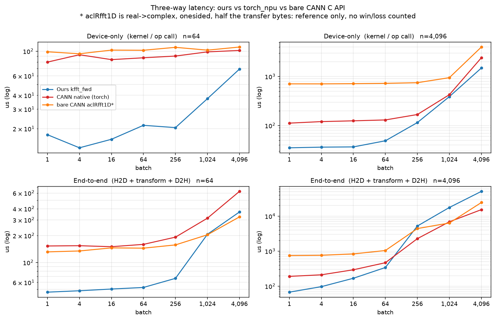

# 实验对比（图 + 详表）

> 表格读起来费劲，本文把同样的数据画成图；图由 `scripts/plot_results.py` 从已有表格/JSON 生成，**不重复测量**。数字口径与 [`matrix_test_a7.md`](matrix_test_a7.md)、[`性能对比-标准库vs自研.md`](性能对比-标准库vs自研.md)、`results/e2e.json` 完全一致。

> **复现脚本**：[`scripts/matrix_test.py`](../scripts/matrix_test.py) 图1~3 的矩阵 · [`scripts/e2e_test.py`](../scripts/e2e_test.py) 图6/图7 端到端三路 · [`scripts/e2e_test.py --app all`](../scripts/e2e_test.py) §6.4 三类应用负载 · [`scripts/gen_stdlib_doc.py`](../scripts/gen_stdlib_doc.py) 图4 六基线 · [`scripts/calib_eta.py`](../scripts/calib_eta.py) 图5 η 标定 · [`scripts/plot_results.py`](../scripts/plot_results.py) + [`scripts/gen_compare_doc.py`](../scripts/gen_compare_doc.py) 生成图与本文 · [`scripts/repro.sh`](../scripts/repro.sh) 全仓实验清单。

| 想看什么 | 直接跳 |
|---|---|
| 一眼看谁快 | [图1](#图1-49-点-speedup-热力图) |
| 绝对延迟多少 | [图2](#图2-延迟热力图) |
| batch 变大怎么变 | [图3](#图3-speedup-与延迟随-batch-缩放) |
| 和 numpy/torch 等比 | [图4](#图4-六基线同场对比) |
| 成本模型准不准 | [图5](#图5-成本模型-η-vs-实测) |
| 真实搬运数据后还快吗 | [图6](#图6-端到端测试) |
| 和裸 CANN C API 比 | [图7](#图7-三路端到端自研--torch--裸-cann) |

---

## 0　实验设置

| 项 | 值 |
|---|---|
| 硬件 | Ascend910_9382，48 AIV，UB 196608 B |
| 软件 | CANN 9.0.0（`ccec` + `libascendcl`），torch_npu 2.10.0 |
| 参考 | 双精度 CPU DIT，判据 `maxRel ≤ 1e-4` |
| 网格 | `n ∈ [64, 128, 256, 512, 1024, 2048, 4096]` × `batch ∈ [1, 4, 16, 64, 256, 1024, 4096]`，共 49 点 |
| 统计 | `--rounds 3` 逐点 **min-of-means**（自研与原生同口径） |
| 宿主 | `nproc=1`、`loadavg≈24` —— CPU 基线有 ±15% 抖动，NPU 列抖动较小 |

**比值定义**：`速度比 = 原生耗时 ÷ 自研耗时`，**>1 表示自研更快**。

**两种口径**：
- **device-only**：只计 kernel 发射 + 同步（含 launch 开销），不含数据搬运；
- **端到端 E2E**：H2D + 变换 + D2H，不含进程启动与输入生成。

---

## 图1　49 点 speedup 热力图


**49/49 个点自研更快**（几何均值 **3.01×**，最紧 **1.04×** @ `n=1024/B=4096`，最好 **6.86×** @ `n=128/B=4`）。

**形状趋势**：颜色随 `batch` 增大由绿转黄 —— 小/中 batch 是自研的强区（3~7×），大 batch（≥1024）两侧都逼近各自的访存上限，差距收窄到 1.0~1.6×。`n=4096/B=4096` 的 1.64× 是**在带宽受限区仍然赢**的点（原生 2444.7 vs 自研 1492.7 µs）。

**优势集中在哪**：`B≤64` 一档 **2.3~6.9×**（几何均值 **4.1×**），`B=4096` 一档收窄到 **1.0~1.6×**；整张表没有任何一格跌破 1.0×。原因见 [图3](#图3-speedup-与延迟随-batch-缩放) 与[批折叠与核心组织](design/kernels.md#已实现的核心与组织)。

### 表1　49 点详表（含迷你条，条越长越快）

| n | batch | 自研 (µs) | 原生 (µs) | 速度比 | 分布 | η (µs) | η 偏差 | maxRel |
|---:|---:|---:|---:|---:|:---|---:|---:|:---|
| 64 | 1 | 18.9 | 81.1 | **4.29×** | `██████████████░░░░` | 17.8 | -5.8% | 5.24e-08 |
| 64 | 4 | 16.1 | 88.3 | **5.48×** | `████████████████░░` | 17.8 | +10.6% | 7.05e-08 |
| 64 | 16 | 16.7 | 81.9 | **4.90×** | `███████████████░░░` | 17.8 | +6.6% | 1.11e-07 |
| 64 | 64 | 20.9 | 84.8 | **4.06×** | `█████████████░░░░░` | 20.0 | -4.3% | 1.14e-07 |
| 64 | 256 | 24.5 | 92.6 | **3.78×** | `████████████░░░░░░` | 20.8 | -15.1% | 1.64e-07 |
| 64 | 1024 | 35.9 | 97.0 | **2.70×** | `█████████░░░░░░░░░` | 30.1 | -16.2% | 2.24e-07 |
| 64 | 4096 | 68.1 | 101.2 | **1.49×** | `███░░░░░░░░░░░░░░░` | 67.4 | -1.0% | 2.34e-07 |
| 128 | 1 | 16.2 | 77.3 | **4.77×** | `███████████████░░░` | 18.1 | +11.7% | 7.41e-08 |
| 128 | 4 | 16.0 | 109.7 | **6.86×** | `██████████████████` | 18.1 | +13.1% | 1.22e-07 |
| 128 | 16 | 14.3 | 82.4 | **5.76×** | `████████████████░░` | 18.1 | +26.6% | 1.22e-07 |
| 128 | 64 | 20.1 | 92.8 | **4.62×** | `██████████████░░░░` | 20.1 | +0.0% | 1.49e-07 |
| 128 | 256 | 27.5 | 96.2 | **3.50×** | `████████████░░░░░░` | 22.1 | -19.6% | 1.63e-07 |
| 128 | 1024 | 33.0 | 102.7 | **3.11×** | `██████████░░░░░░░░` | 33.9 | +2.7% | 2.34e-07 |
| 128 | 4096 | 76.2 | 118.2 | **1.55×** | `████░░░░░░░░░░░░░░` | 81.5 | +7.0% | 2.44e-07 |
| 256 | 1 | 20.6 | 84.1 | **4.08×** | `█████████████░░░░░` | 18.6 | -9.7% | 9.33e-08 |
| 256 | 4 | 21.0 | 85.9 | **4.09×** | `█████████████░░░░░` | 18.6 | -11.4% | 9.33e-08 |
| 256 | 16 | 19.4 | 86.5 | **4.46×** | `██████████████░░░░` | 18.6 | -4.1% | 1.96e-07 |
| 256 | 64 | 21.0 | 97.0 | **4.62×** | `██████████████░░░░` | 22.4 | +6.7% | 2.04e-07 |
| 256 | 256 | 26.2 | 99.0 | **3.78×** | `████████████░░░░░░` | 24.8 | -5.3% | 2.29e-07 |
| 256 | 1024 | 42.4 | 107.1 | **2.53×** | `████████░░░░░░░░░░` | 42.2 | -0.5% | 2.35e-07 |
| 256 | 4096 | 101.2 | 131.3 | **1.30×** | `██░░░░░░░░░░░░░░░░` | 111.6 | +10.3% | 2.38e-07 |
| 512 | 1 | 18.9 | 85.4 | **4.52×** | `██████████████░░░░` | 19.4 | +2.6% | 9.06e-08 |
| 512 | 4 | 21.8 | 100.2 | **4.60×** | `██████████████░░░░` | 19.4 | -11.0% | 1.15e-07 |
| 512 | 16 | 20.0 | 91.2 | **4.56×** | `██████████████░░░░` | 19.4 | -3.0% | 1.88e-07 |
| 512 | 64 | 25.7 | 95.1 | **3.70×** | `████████████░░░░░░` | 25.9 | +0.8% | 1.88e-07 |
| 512 | 256 | 32.2 | 106.4 | **3.30×** | `███████████░░░░░░░` | 30.6 | -5.0% | 2.26e-07 |
| 512 | 1024 | 57.2 | 144.5 | **2.53×** | `████████░░░░░░░░░░` | 59.7 | +4.4% | 2.35e-07 |
| 512 | 4096 | 159.9 | 206.5 | **1.29×** | `██░░░░░░░░░░░░░░░░` | 176.0 | +10.1% | 2.41e-07 |
| 1024 | 1 | 26.5 | 95.8 | **3.62×** | `████████████░░░░░░` | 22.5 | -15.1% | 6.72e-08 |
| 1024 | 4 | 21.4 | 99.9 | **4.67×** | `██████████████░░░░` | 22.5 | +5.1% | 1.13e-07 |
| 1024 | 16 | 26.2 | 101.0 | **3.85×** | `████████████░░░░░░` | 22.5 | -14.1% | 1.28e-07 |
| 1024 | 64 | 29.1 | 97.8 | **3.36×** | `███████████░░░░░░░` | 29.0 | -0.3% | 2.33e-07 |
| 1024 | 256 | 40.2 | 103.3 | **2.57×** | `█████████░░░░░░░░░` | 45.7 | +13.7% | 2.33e-07 |
| 1024 | 1024 | 90.3 | 140.1 | **1.55×** | `████░░░░░░░░░░░░░░` | 104.9 | +16.2% | 2.33e-07 |
| 1024 | 4096 | 317.4 | 330.7 | **1.04×** | `█░░░░░░░░░░░░░░░░░` | 341.6 | +7.6% | 2.36e-07 |
| 2048 | 1 | 23.7 | 102.0 | **4.30×** | `██████████████░░░░` | 24.4 | +3.0% | 4.52e-08 |
| 2048 | 4 | 26.7 | 109.5 | **4.10×** | `█████████████░░░░░` | 24.4 | -8.6% | 1.18e-07 |
| 2048 | 16 | 27.2 | 107.4 | **3.95×** | `█████████████░░░░░` | 24.4 | -10.3% | 1.18e-07 |
| 2048 | 64 | 36.3 | 105.6 | **2.91×** | `██████████░░░░░░░░` | 32.7 | -9.9% | 1.90e-07 |
| 2048 | 256 | 64.9 | 135.5 | **2.09×** | `███████░░░░░░░░░░░` | 65.9 | +1.5% | 2.36e-07 |
| 2048 | 1024 | 198.6 | 314.2 | **1.58×** | `████░░░░░░░░░░░░░░` | 198.8 | +0.1% | 2.36e-07 |
| 2048 | 4096 | 722.3 | 993.5 | **1.38×** | `███░░░░░░░░░░░░░░░` | 730.2 | +1.1% | 2.38e-07 |
| 4096 | 1 | 33.6 | 105.4 | **3.14×** | `███████████░░░░░░░` | 32.3 | -3.9% | 1.06e-07 |
| 4096 | 4 | 35.8 | 116.5 | **3.25×** | `███████████░░░░░░░` | 32.3 | -9.8% | 1.35e-07 |
| 4096 | 16 | 36.5 | 116.6 | **3.19×** | `███████████░░░░░░░` | 32.3 | -11.5% | 1.35e-07 |
| 4096 | 64 | 53.0 | 122.5 | **2.31×** | `████████░░░░░░░░░░` | 48.5 | -8.5% | 2.05e-07 |
| 4096 | 256 | 111.6 | 166.9 | **1.50×** | `███░░░░░░░░░░░░░░░` | 113.2 | +1.4% | 2.26e-07 |
| 4096 | 1024 | 390.0 | 423.3 | **1.09×** | `█░░░░░░░░░░░░░░░░░` | 372.1 | -4.6% | 2.36e-07 |
| 4096 | 4096 | 1,492.7 | 2,444.7 | **1.64×** | `████░░░░░░░░░░░░░░` | 1,407.8 | -5.7% | 2.41e-07 |

---

## 图2　延迟热力图


同一份数据的**绝对值**视角：左图自研、右图原生，共用对数色标。原生那一侧整片偏红且几乎不随 `n` 变（77→2445 µs 中，`B=1` 一行稳定在 77~105 µs —— 是**固定 launch/调度开销**），自研那一侧 `B≤64` 全在 14~53 µs，说明自研把固定开销压下去了。

---

## 图3　speedup 与延迟随 batch 缩放


左图每条线是一个 `n`：**7 条线全部在 1.0× 虚线之上**，且整体从 `B=4` 的 4~7× 单调下滑到 `B=4096` 的 1.0~1.6×。右图是自研绝对延迟（对数轴），`B≤64` 几乎是平的 —— 这个区间被固定开销主导，`B>64` 才开始随 batch 线性上升。

**具体读数**：`B≤64` 这一档几乎不随 batch 变（`n=1024` 只从 26.5 涨到 29.1 µs，B=1→64），`B>64` 才开始真正随 batch 上升（`n=4096` 从 53.0 走到 1492.7 µs，B=64→4096）。

**读法：小 batch 赢在 launch 开销低，大 batch 赢在每元素算得少。**机制见 [批折叠与核心组织](design/kernels.md#已实现的核心与组织)。

---

## 图4　六基线同场对比


取 6 个代表形状，6 根柱子同场（对数轴）。柱顶蓝色标注是 **原生 ÷ 自研**（>1 = 自研更快）。

### 表2　代表形状的六基线数值（µs）

| n | batch | numpy (CPU) | torch (CPU) | CANN 原生 | aclRfft1D | 自研 v1 | **自研当前** | ÷原生 | ÷numpy | ÷torch |
|---:|---:|---:|---:|---:|---:|---:|---:|---:|---:|---:|
| 64 | 1 | 3.4 | 3.8 | 81.1 | 98.7 | 24.0 | **18.9** | **4.29×** | 0.18× | 0.20× |
| 64 | 4096 | 1,165.2 | 543.7 | 101.2 | 106.9 | 816.9 | **68.1** | **1.49×** | 17.11× | 7.98× |
| 1024 | 1 | 10.1 | 11.3 | 95.8 | 139.6 | 158.7 | **26.5** | **3.62×** | 0.38× | 0.43× |
| 1024 | 4096 | 43,923.3 | 41,975.8 | 330.7 | 416.2 | 12,315.9 | **317.4** | **1.04×** | 138.38× | 132.25× |
| 4096 | 1 | 39.9 | 34.3 | 105.4 | 716.0 | 595.3 | **33.6** | **3.14×** | 1.19× | 1.02× |
| 4096 | 4096 | 196,139.7 | 696,110.7 | 2,444.7 | 4,010.3 | 49,307.8 | **1,492.7** | **1.64×** | 131.40× | 466.34× |

**读法**：NPU 上自研对 CANN 原生全胜；对 CPU 基线，`batch ≥ 1024` 的 14/14 点赢 numpy、14/14 点赢 torch —— 小 batch 输给 CPU 是因为 3~20 µs 的量级里 CPU 单核已经够快，NPU 要付固定的发射开销。`aclRfft1D` 是实→复变换，仅作参照。

---

## 图5　成本模型 η vs 实测


49 个点全部贴在理想线附近：**平均 |偏差| 7.7%**，落在 ±15% 带内的 43/49。带外的 6 个点是 `n=64/B=256`(-15.1%)、`n=64/B=1024`(-16.2%)、`n=128/B=16`(+26.6%)、`n=128/B=256`(-19.6%)、`n=1024/B=1`(-15.1%)、`n=1024/B=1024`(+16.2%)；其中 `n=1024/B=1024` 的单轮 `mean/min` < 1.28，是模型真实的高估点；其余 5 个的 `mean/min` ≥ 1.28，是宿主负载离群点。

η 的作用是在 **kernel 还没编译**时就排出生命周期里的 launch 参数（`AB_FOLD_D` / `AB_PLANE_K`），这是选型闭环能跑起来的前提。

实测回填再补一刀：`Plan::measure()` 真跑一次把结果写回候选，`rank()` 按 `Measured > Feasible` 分层，估的和测的互相校正 —— 标定方法与系数含义见 [性能模型 · 校准与证据边界](design/performance-model.md#校准与证据边界)。

---

## 图6　端到端测试


上半：灰柱是 device-only、彩色柱是端到端（绿=更快、红=更慢），对数轴。下半：**内核之外的时间占比**（`1 − device/E2E`），即 H2D + D2H + 同步。

| 指标 | 结果 |
|---|---|
| 正确性 | **49/49 PASS** |
| device-only | **49/49 更快**，几何均值 **3.17×** |
| **端到端 E2E** | **46/49 更快**，几何均值 **1.66×** |
| E2E 最快 / 最慢 | **2.70×** @ `n=512/B=4` ｜ **0.95×** @ `n=1024/B=4096` |
| 内核外时间占比 | 中位 **76%**，最大 **83%** |

> ⚠️ 上表的 `device-only` 是 **e2e_test 自己那一轮**（`reps=10`）顺带测的，与 [图1/表1](#表1-49-点详表含迷你条条越长越快) 的 `matrix_test`（`reps=20`、另一时段）是两次独立测量，几何均值 3.17× vs 3.01× —— 差异在本机负载抖动范围内，**两列都各自与同轮的对手同口径**，跨表不要混引。

**这一段在实际程序里对应什么。** 端到端计时的 `H2D → 一次前向复数 FFT → D2H`，就是「数据在 host、变换在卡上」这类程序的最小闭环，典型有三类 —— 多载波通信 / 频域均衡（一帧 OFDM 符号上卡逐符号 FFT，`batch` = 符号数；开源参考 [srsRAN](https://github.com/srsran)、[GNU Radio](https://github.com/gnuradio/gnuradio)）、雷达成像的距离门（一帧内多路回波做距离 FFT，`batch` = 脉冲 / 通道数）、深度学习的频域层（频域中间特征，`batch` = 样本 × 序列；开源参考 [Kymatio](https://github.com/kymatio/kymatio)、PyTorch `torch.fft`）。三者在这一步的形状完全相同，且**本节数字用随机输入测** —— 这三段耗时只取决于字节数与 kernel，与数据内容无关；三者各自的前处理（解调、CFAR、反归一化）**不在**计时区内。

### 6.1　结果怎么读

1. **中小尺寸（`B ≤ 256` 且 `n ≤ 1024`，25 点）**：内核占大头，device-only 的优势基本传导到端到端，**25/25 更快**。
2. **传输量大（`n ≥ 512` 且 `B ≥ 256`，12 点）**：内核外时间占比 **77~83%**，端到端被 PCIe 搬运封顶，两者一起变慢 —— 此时**比的不是 FFT，是数据搬运**。
   其中 `B≥1024` 一档占 **69~83%** —— 那一档比的不是 FFT，是 PCIe。
3. 因此端到端 **46/49** 而不是 49/49 是**预期行为**，不是内核退化：输掉的 3 个点是 **0.95×~0.99×** 的持平档，device-only 一列仍然 49/49。

### 6.2　口径

| | 自研 | CANN 原生 |
|---|---|---|
| 计时区 | `aclrtMemcpyAsync`(H2D) → `kfft_fwd` → `aclrtMemcpyAsync`(D2H) | `xd.copy_(x_cpu)` → `torch.fft.fft(xd)` → `yd.copy_(out)` |
| 主机缓冲 | `aclrtMallocHost`（pinned，`AB_E2E_HOST` 默认） | 源 `.pin_memory()` + 预分配 pinned 目的张量 |
| 计时区外 | 进程启动(`boot`)、plan 准备(`plan`)、输入生成 | 框架启动、该 shape 冷 `first` 单列 |
| 统计 | `--rounds 3` min-of-means，reps=10 | 同 |

复现：`python3 scripts/e2e_test.py --reps 10 --rounds 3`（默认 `AB_E2E_HOST=pinned`，`AB_E2E_HOST=pageable` 切回受限口径）

### 6.3　已知局限（必须一起读）

**主机缓冲口径（三方默认 pinned）**：H2D/D2H 的主机侧缓冲默认都是 **pinned** —— 自研/裸 CANN 走 `aclrtMallocHost`，torch_npu 走 `.pin_memory()` 源张量 + 预分配 pinned 目的张量；换缓冲**只影响 E2E，`device-only` 一列完全不受影响**。**早期三方全用 pageable 主机缓冲的那一版口径已作废**：pageable 的 H2D/D2H 走主机侧 staging + 缺页，会把「拷贝路径没选对」记进端到端结果，本节数字全部为 pinned 口径。

要自行核对这条边界，用受限口径复跑同一个点即可：`AB_E2E_HOST=pageable python3 scripts/e2e_test.py --ns 4096 --bs 4096 --rounds 3`（与默认口径对比时只看 `E2E` 两列，`device` 列应几乎不动）。

- **有效带宽（三方都是 pinned）**：`B ≥ 1024` 的 14 个点上，按「传输字节 ÷ E2E」算（含 kernel 与同步，几何均值）：**自研 26.9、裸 15.0、torch_npu 22.8 GB/s**；最大点 `n=4096/B=4096` 分别 **37.2 / 19.4 / 33.9 GB/s**。两条 `aclrtMemcpyAsync` 路径与 torch 落在同一量级（自研/torch = **1.18**），说明拷贝通路不再是瓶颈，剩下的差额在 kernel 与 launch（`device-only` 一列不受主机缓冲影响）。注：裸一路 E2E 里算子占比更大、搬运量只有 8nB（实部输入），带宽被摊薄，只作量级参照。
- **抖动**：传输量大时单轮 E2E 的 `mean/min` 可差 1.5×，所以必须看 min-of-means；本机 `nproc=1`、`loadavg` 常年 20+，跨时段的绝对值不可直接比，只能同轮比。
- **公平性**：两侧都在计时区外剔除了一次性开销（`boot`/`plan` vs 框架启动/冷 `first`），主机缓冲口径一致（pinned），自研的 H2D/D2H 与 torch 的 `copy_` 都计入计时区；原生的输出张量由 `torch.fft.fft` 每次分配，但 torch_npu 的 caching allocator 使其在 warmup 后接近常数开销，与自研的预分配 `dOut` 量级相当。

### 6.4　三类典型应用负载

把随机输入换成**应用形状的输入**（自研 `AB_INPUT=<app>`、原生 `--input <app>`，C++ 与 numpy 同一套 xorshift32、**逐位同式**），按三类典型应用的代表形状各测一遍；三方口径与 [§6.2](#62-口径) 完全一致（pinned、min-of-means、计时区外剔除启动与输入生成），输出仍与各自双精度参考逐点比对（判据 `1e-4`）。

| 应用 | n | batch | 搬运量 | 自研 device | 原生 device | device 比值 | **自研 E2E** | **原生 E2E** | **E2E 比值** | maxRel | 正确性 |
|:---|---:|---:|---:|---:|---:|---:|---:|---:|---:|---:|:---|
| ofdm | 2048 | 14 | 448 KB | 28.7 | 102.3 | 3.56× | **103.9** | **199.1** | **1.92×** | 1.57e-07 | PASS |
| ofdm | 2048 | 140 | 4.4 MB | 42.0 | 134.2 | 3.20× | **196.8** | **299.6** | **1.52×** | 1.94e-07 | PASS |
| ofdm | 4096 | 14 | 896 KB | 36.3 | 120.5 | 3.32× | **110.9** | **215.8** | **1.95×** | 1.32e-07 | PASS |
| ofdm | 4096 | 140 | 8.8 MB | 66.5 | 180.0 | 2.71× | **314.8** | **444.1** | **1.41×** | 2.25e-07 | PASS |
| radar | 1024 | 64 | 1.0 MB | 28.4 | 85.5 | 3.01× | **115.6** | **188.2** | **1.63×** | 1.21e-07 | PASS |
| radar | 1024 | 256 | 4.0 MB | 42.3 | 100.7 | 2.38× | **179.6** | **261.8** | **1.46×** | 1.21e-07 | PASS |
| radar | 2048 | 64 | 2.0 MB | 29.8 | 102.2 | 3.43× | **142.1** | **225.9** | **1.59×** | 1.21e-07 | PASS |
| radar | 2048 | 256 | 8.0 MB | 65.0 | 140.2 | 2.16× | **286.7** | **382.2** | **1.33×** | 1.21e-07 | PASS |
| dl | 1024 | 32 | 512 KB | 21.0 | 105.4 | 5.02× | **88.1** | **238.1** | **2.70×** | 2.81e-07 | PASS |
| dl | 1024 | 128 | 2.0 MB | 30.3 | 102.6 | 3.39× | **121.8** | **240.0** | **1.97×** | 2.81e-07 | PASS |
| dl | 4096 | 32 | 2.0 MB | 30.1 | 118.6 | 3.94× | **122.1** | **253.5** | **2.08×** | 2.51e-07 | PASS |
| dl | 4096 | 128 | 8.0 MB | 63.3 | 148.0 | 2.34× | **298.7** | **395.3** | **1.32×** | 2.84e-07 | PASS |

- 正确性：**12/12 PASS**（maxRel ≤ 1e-4）；device-only **12/12**、几何均值 **3.12×**，端到端 **12/12**、几何均值 **1.70×** —— 与网格口径（§6.1 的 46/49、1.66×）同量级，说明**换成应用形状的输入与代表性 (n, batch) 不改变结论**。
- 口径：`--reps 10`、`--rounds 3` 逐点 min-of-means；裸 CANN 一路（实→复、搬运量减半）在应用负载模式下**不跑**。复现：`python3 scripts/e2e_test.py --app all --reps 10 --rounds 3`。

---

## 图7　三路端到端：自研 / torch / 裸 CANN



为什么要第三路：**CANN 9.0.0 的公开头文件里没有复数→复数的 FFT C API**（`include/` 全量扫描只有 `aclnnop/acl_rfft1d.h` 与 `acl_stft.h`，`libopapi.so` 也没有 `Dft`/`Aclfft` 导出符号）。我们一路叫「CANN 原生」的 `torch.fft.fft`，其 `_fft_c2c` 实际由 **torch_npu 自带的 op-plugin** 实现（`FFTc2cKernelNpuOpApi.cpp` / `FFTPlanNpuOpApi.cpp`，并暴露 `torch_npu.npu` 的 fft plan cache），**不是 CANN 算子库条目**（已实测确认它确实在设备上跑：`n=4096/B=4096` 时 NPU 2,356 µs vs CPU 740,191 µs）。所以补一路 `aclRfft1D`，把「CANN 算子调用路径本身的固定开销」和「torch 层」分开。

| | 自研 | CANN 原生（表1/图6） | 裸 CANN（本节） |
|---|---|---|---|
| 实现 | AscendC `kfft_fwd` | torch_npu op-plugin | CANN `aclRfft1D`（aclNN） |
| 变换 | 复→复 | 复→复 | **实→复、单边** |
| 搬运量 (H2D+D2H) | `16n·B` | `16n·B` | **`8n·B`（一半）** |
| 调用约定 | 自带 plan，一次性 | plan cache 跨调用复用 | 两段式，**每轮重新 `GetWorkspaceSize`**（executor 不可复用） |
| workspace | 无 | 由框架管理 | **固定 ~2.16 GB**（与 shape 无关） |

| 指标（几何均值） | 结果 |
|---|---|
| 裸 device-only（49 点） | **189.5 µs** |
| 裸 E2E（49 点） | **305.0 µs** |
| `B≤64`（28 点，传输占比小）device | 裸 **164.0 µs** ｜ 原生 **97.7 µs** ｜ 自研 **22.3 µs** |
| `n≤256 且 B≤64`（12 点，传输 < 1 MB）device | 裸 **102.6 µs** ｜ 原生 **91.8 µs** ｜ 自研 **18.9 µs** |
| 原生 device ÷ 裸 device（49 点） | **0.67×**（两路变换不同，只看固定开销量级） |
| 裸一路正确性 | **49/49 PASS**（与 `numpy.fft.rfft` 同义，`norm=1` 实测 = 前向不缩放） |

**怎么读**：

1. 传输可忽略的 `12` 个点上，裸 CANN device **103 µs**、torch 原生 **92 µs**、自研 **19 µs** —— 那 ~100 µs 的固定开销**在 CANN 算子调用路径本身**，不是 torch 那一层的额外包装。
2. 但裸 CANN 反而**比 torch 略慢**：两段式约定要求每轮 `GetWorkspaceSize`，而 torch 侧有 plan cache —— 「裸」不等于「快」。裸一路在 `n` 变大时 `GetWorkspaceSize` 成本随之上升（`B=1` 时 `n=64`→`n=4096` 由 ~103 µs 涨到 ~703 µs），而 torch 原生在 `B=1` 上全程压在 ~78~99 µs。
3. E2E 一列**不能直接比胜负**：`aclRfft1D` 是实→复、搬运量只有一半，大 batch 下它的 E2E 天然占优；本节只用来定位固定开销的来源。
4. 裸一路是**单进程单 shape**，每个 shape 都从零建图，所以 `bare_first_us`（0.4~2 s）与原生的 `first_us`（单进程跑全网格、plan cache 跨 shape 复用）**口径不同，不可直接比**，故不出现在正文表里。

---

## 7　一键复现

```bash
# 0) 从零初始化：环境体检 → 编译 → 4 道门禁
scripts/init.sh

# 1) 门禁 + 49 点 device-only 矩阵（生成 docs/matrix_test_a7.md 同构数据）
scripts/one_click_test.sh

# 2) 端到端测试（生成 results/e2e.{md,json}，含裸 CANN 第三路）
python3 scripts/e2e_test.py --reps 10 --rounds 3

# 3) 出图 + 出本文档
python3 scripts/plot_results.py
python3 scripts/gen_compare_doc.py
```

本文件涉及的实验都能按名字跑（`scripts/repro.sh --list` 看全仓清单）：

```bash
scripts/repro.sh gate        # 4 道门禁
scripts/repro.sh matrix      # 49 点矩阵
scripts/repro.sh e2e         # 端到端三路（图6/图7）
scripts/repro.sh figures     # 出图
scripts/repro.sh doc         # 出本文档
scripts/hw_probe.sh          # 硬件能力探针（换 SoC 后先跑）
scripts/profile_test.sh      # msprof 采集 + 汇总（管线占用率表的出处）
python3 scripts/ab_test.py --base <基线.o> --cand build/fft_radix2.o  # A/B 消融
```

> 图用英文标签是刻意的：仓库外的机器不一定有 CJK 字体，中文图例换台机器就变豆腐块。中文说明都在本文的图注里。

